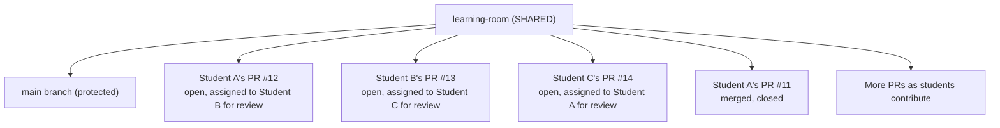

# The Learning Room: Shared Practice Repository
>
> **Listen to Episode 4:** [The Learning Room](../PODCASTS.md) - a conversational audio overview of this chapter. Listen before reading to preview the concepts, or after to reinforce what you learned.

## What Is the Learning Room?

The **Learning Room** is a single, shared GitHub repository where all workshop participants collaborate together. It is not your personal fork. It is not your individual repository. It is one repo with many students, many branches, and many pull requests.


## Workshop Recommendation (Chapter 3)

Chapter 3 is a **system orientation chapter**.

- **Challenge count:** none
- **Automation check:** none
- **Why:** this chapter explains the shared workflow and prepares students for issue-based challenges in Chapters 4 and 5.

### Readiness Checkpoint

Before starting Chapter 4 challenges, students should be able to:

1. Find `learning-room/docs/CHALLENGES.md`.
2. Explain issue -> branch -> PR -> review -> merge.
3. Identify where bot feedback appears on PRs.

The learning-room is a single shared repository. It has a protected main branch, and each student opens pull requests against it. For example: Student A's PR #12 is open and assigned to Student B for review, Student B's PR #13 is assigned to Student C, Student C's PR #14 is assigned to Student A, and Student A's earlier PR #11 has already been merged. More PRs appear as students contribute.

<details>
<summary>Visual diagram (Mermaid)</summary>



</details>

### Why one shared repo?

- **Realistic** - Open source projects are shared spaces
- **Community** - You see each other's work and learn from each other
- **Peer review** - You review the people sitting next to you
- **Automation** - The bot serves one repo, coordinating all contributions


## Two Tracks, One Repository

Throughout Day 1, you work on **two parallel learning tracks**:

### Track 1: GitHub Skills Modules (Your Account)

- **[Introduction to GitHub](https://github.com/skills/introduction-to-github)** - Create branch, open PR, merge
- **[Communicate Using Markdown](https://github.com/skills/communicate-using-markdown)** - Write headings, links, code, tables
- **[Review Pull Requests](https://github.com/skills/review-pull-requests)** - Comment, approve, suggest changes

**Scope:** Your personal account (private to you unless you make it public)  
**Bot:** Mona (GitHub's automated learning bot) guides each step  
**Pace:** Self-directed, you complete at your own speed  
**Purpose:** Hands-on practice of individual skills

### Track 2: Learning Room Contribution Sprint (Shared)

- **Block 5:** Your first real contribution (you and 5-20 other students contributing simultaneously)
- **Block 6:** Community tools (labels, milestones, notifications)

**Scope:** The shared `learning-room` repository (one repo, visible to everyone)  
**Bot:** The Learning Room automation bot validates PRs and tracks progress  
**Pace:** Structured by facilitator; synchronized with workshop schedule  
**Purpose:** Collaborative practice of the full workflow (issue → branch → PR → review → merge)

#### The Two Tracks Reinforce Each Other

| Step | Skills Module (individual) | Learning Room (group) |
| --- | --- | --- |
| 1 | Create a branch | Create a branch (together) |
| 2 | Open a PR | Open a PR (see others' too) |
| 3 | Get instant bot feedback | Get bot feedback + human review |
| 4 | Mona verifies your step | Human peer reviewer approves |
| 5 | Next step unlocked | Ready to merge |


## Learning Room Folder Structure

```text
learning-room/
+-- README.md                           ← Getting started guide
+-- AUTOMATION.md                       ← How the bot works
+-- .github/
|   +-- workflows/                      ← 3 automation workflows
|   |   +-- learning-room-pr-bot.yml            (PR validation)
|   |   +-- skills-progression.yml              (progress tracking)
|   |   +-- student-grouping.yml                (peer pairing)
|   +-- scripts/
|   |   +-- validate-pr.js                      (validation logic)
|   +-- data/
|   |   +-- student-roster.json                 (your cohort info)
|   |   +-- challenge-progression.json          (levels, badges)
|   +-- docs/
|       +-- LEARNING_PATHS.md                   (skill progression guide)
|       +-- IMPLEMENTATION_GUIDE.md             (facilitator setup)
+-- docs/
|   +-- CHALLENGES.md                   ← 12 challenges (Beginner → Expert)
|   +-- GROUP_CHALLENGES.md             ← 7 collaborative exercises
|   +-- welcome.md                      ← Has [TODO] to complete
|   +-- keyboard-shortcuts.md           ← Has intentional errors
|   +-- setup-guide.md                  ← Has broken links
+-- [other files for practice]
```


## Your Practice Branch

When you join the workshop, the facilitator creates a **personal practice branch** for you in the Learning Room repository. This branch is automatically created using your GitHub username with `-practice` appended:

> **Branch naming convention:** `username-practice` (all lowercase)

**Examples:**
- If your GitHub username is `payown`, your practice branch is `payown-practice`
- If your username is `BudgieMom`, your practice branch is `budgiemom-practice`
- If your username is `Weijun-Zhang-1996`, your practice branch is `weijun-zhang-1996-practice`

### Why you have a practice branch

- **Protected main branch** - The `main` branch in the Learning Room is protected and requires pull requests for all changes
- **Your workspace** - Your practice branch is where you commit and push changes before opening a PR
- **No conflicts** - Each student has their own branch, so you will never accidentally overwrite someone else's work
- **Realistic workflow** - This mirrors how real open source projects work - contributors create feature branches and submit pull requests

### How to use your practice branch

1. When you clone the Learning Room repository locally (Chapter 11), switch to your practice branch:
   ```bash
   git checkout username-practice
   ```
2. Make your changes, commit them to your practice branch
3. Push your practice branch to GitHub
4. Open a pull request from your practice branch → `main`

> **Note:** For GitHub web-based editing (Chapters 4-5), you can create temporary feature branches with descriptive names like `fix/welcome-todos` or `add/keyboard-shortcuts`. Your practice branch becomes essential when you start working locally with Git in Chapter 11.


## The Practice Files: What You Will Work On

The `docs/` folder contains three practice files with intentional issues. These are the files you will edit, fix, and submit pull requests for during the contribution sprint. Here is exactly what you will encounter in each file.

### docs/welcome.md - Introduction to Open Source Contribution

This file introduces newcomers to open source. It has **three [TODO] sections** where content is missing:

#### [TODO] 1 - "Who Can Contribute?" section
>
> [TODO: Add a paragraph explaining that contributors come from all backgrounds, skill levels, and countries. Emphasize that using assistive technology is not a barrier to contribution - in fact, AT users bring a perspective that improves projects for everyone.]

#### [TODO] 2 - "Finding Something to Work On" section
>
> [TODO: Add two or three sentences about how to read an issue to decide if it is right for you. What questions should you ask yourself? Is the description clear enough? Is anyone else already working on it?]

#### [TODO] 3 - "After Your Contribution Is Merged" section
>
> [TODO: Add a sentence or two about what this means for someone's GitHub profile and open source portfolio.]

It also has a broken internal link that needs to be found and fixed. **Challenges 1 and 3** from CHALLENGES.md map directly to this file.

### docs/keyboard-shortcuts.md - Screen Reader Shortcut Reference

This is a comprehensive reference with tables for NVDA, JAWS, and VoiceOver shortcuts. It contains **intentional errors** in some shortcut references that students need to find and fix.

The file has three major sections:

- **NVDA (Windows)** - Single-key navigation, mode switching, reading commands
- **JAWS (Windows)** - Virtual cursor navigation, mode switching, reading commands
- **VoiceOver (macOS)** - Rotor navigation, VO commands for GitHub

Plus cross-platform shortcuts for GitHub pages and common workarounds.

**Challenge 2** asks you to add a missing shortcut to the correct table. When you edit this file, you must preserve the Markdown table formatting. The bot validates that tables remain well-formed.

### docs/setup-guide.md - Getting Ready to Contribute

This step-by-step guide walks through GitHub account setup, accessibility settings, screen reader configuration, and repository forking. It contains **broken links** that point to incorrect URLs and **incomplete steps**.

Look for:

- Links to GitHub settings pages that may have changed
- A `[TODO]` note at the bottom referencing items for facilitators
- Steps that reference forking a "workshop repository" without providing the actual URL

This file is used for **intermediate and advanced challenges** (Challenges 4-6) where students fix heading hierarchy, improve link text, and add missing descriptions.

### docs/CHALLENGES.md - Your Challenge Menu

This file lists all 12 challenges organized by skill level:

| Level | Challenges | Requirement |
| -------  | -----------  | -------------  |
| Beginner (1-3) | Fix broken link, add shortcut, complete welcome guide | 0+ merged PRs |
| Intermediate (4-6) | Fix heading hierarchy, improve link text, add alt text | 1+ merged PRs |
| Advanced (7-9) | Accessibility review, create documentation, mentor a peer | 3+ merged PRs |
| Expert (10-12) | Design a challenge, full accessibility audit, create issue template | 5+ merged PRs |

Each challenge lists the file(s) to edit, estimated time, skills practiced, success criteria, and a link to detailed instructions.

### docs/GROUP_CHALLENGES.md - Collaborative Exercises

Seven group exercises for study groups, ranging from a Documentation Sprint (divide `docs/welcome.md` among group members) to a Full Repository Audit (each person audits a section of the workshop documentation). Groups of 2-6 students work together with coordinated PRs and cross-review.


## How PR Sharing Works

### Step 1: Student Opens a PR

#### Student A (working on Challenge 3: Complete Welcome Guide)

1. Finds their assigned issue (Issues tab → filter `Assignee:@me`)
2. Opens `docs/welcome.md` and edits the three `[TODO]` sections
3. Commits to a new branch: `fix/studentA-issue12`
4. Opens a pull request with description:

   ```markdown
   ## What Changed
   Completed the three [TODO] sections in docs/welcome.md:
   - Added contributor backgrounds paragraph
   - Added guidance on evaluating issues
   - Added note about GitHub profile impact

   Closes #12
   ```

5. **Submits the PR**

**Visibility:** The PR immediately appears in the repo's Pull Requests tab. All students can see it.

### Step 2: Automation Bot Validates

#### Bot (`.github/workflows/learning-room-pr-bot.yml`)

- Runs within 30 seconds
- Checks:
  - Issue reference (does PR link to issue with `Closes #12`?)
  - File location (only `docs/` directory files changed?)
  - Markdown accessibility (headings, links, alt text, broken links)
  - [TODO] markers (all three removed from welcome.md?)
- Posts a comprehensive comment with:
  - Required checks (must pass)
  - Suggestions (optional improvements)
  - Accessibility analysis (detailed issues + fixes)
  - Learning resources (links to docs)
- Applies labels (documentation, accessibility, needs-review)
- Creates commit status check visible in PR checks

**Visibility:** The bot comment appears in the PR. All students can read it.

### Step 3: Peer Reviewer Is Assigned

#### Pairing Bot (`.github/workflows/student-grouping.yml`)

- Automatically selects a reviewer (uses `least_reviews` strategy - balances workload)
- Requests review via GitHub API
- Posts assignment comment explaining what to look for
- **Example:**

  ```text
  ## Peer Review Assigned

  Hi @studentA! Your PR has been automatically paired with @studentC for peer review.

  ### For @studentC:
  This is a great opportunity to practice code review skills! Here's what to look for:
  - Did all three [TODO] sections get completed in welcome.md?
  - Does the new content match the style of existing sections?
  - Is the heading hierarchy correct (H1 → H2)?
  - Does the bot report pass all required checks?
  ```

#### Visibility

- Student A sees their assigned reviewer
- Student C receives a notification: "review requested"
- All students see the assignment comment in the PR thread

### Step 4: Reviewer Reads and Comments

#### Student C (the assigned reviewer reviewing the welcome.md changes)

1. Receives notification: "PR review requested"
2. Navigates to the PR in the Learning Room repo
3. Reads:
   - PR title: "Complete [TODO] sections in welcome.md"
   - PR description: lists which sections were completed
   - Bot feedback: checks that all `[TODO]` markers are removed, heading hierarchy is valid
   - The actual file changes (Files Changed tab): sees the diff showing old `[TODO]` markers replaced with new content
4. Leaves review comments:
   - Inline comment on the "Who Can Contribute?" paragraph: "Great addition - I especially like the point about AT users bringing valuable perspective."
   - Overall comment: "The content reads well and all TODOs are resolved. One suggestion: the 'Finding Something to Work On' section could mention checking if an issue already has an assignee."
5. Submits review: **Approve** (or **Request Changes** if a `[TODO]` marker was missed)

#### Visibility

- Student A (PR author) gets notification: "Your PR has a new review"
- All students see the review comments in the PR thread
- Student C's review shows in the Reviewers sidebar

### Step 5: Author Responds and Updates

#### Student A (PR author)

1. Reads the bot feedback and human review
2. Talks to the reviewer if something is unclear
3. Makes changes based on feedback
4. Pushes new commits to the same branch
5. Re-addresses the feedback

#### Visibility

- Bot re-validates on each new commit
- All students see updated activity in the PR
- Timeline shows iteration happening

### Step 6: Merge and Celebration

#### When Reviewer Approves

- Student A merges the PR (button becomes available)
- PR closes, shows "merged"

#### Bot Posts Celebration

- Skills progression bot tracks the merge
- Posts achievement comment (badge earned, level up tracking)
- Updates student roster progress
- Shows milestone celebration if applicable

#### Visibility

- All students see the merged PR
- Achievement comment is public
- Progress reflected in Learning Paths documentation


## What All Students See

| What | Where | Who Sees It |
| ------  | -------  | -----------  |
| All open PRs | Pull Requests tab | Everyone |
| PR description & changes | PR page | Everyone |
| Bot feedback | PR comments | Everyone |
| Peer review comments | PR comments | Everyone |
| Reviewer assignments | PR sidebar "Reviewers" | Everyone |
| Merge celebrations | PR comments | Everyone |
| Your review request | Your notification inbox | You + PR author |
| You assigned as reviewer | Your review requests filter | You + PR author |


## The Learning Automation System

When you open a PR in the Learning Room, you get **three types of feedback**:

### Type 1: Automated Bot Feedback (30 seconds)

- Technical validation (links, headings, file locations)
- Accessibility checking (detailed)
- Educational messaging (WHY each thing matters)
- Links to learning resources
- Never fails the PR; always educational

### Type 2: Peer Reviewer Feedback (15-60 minutes)

- Human judgment on content
- Creative suggestions
- Encouragement and mentorship
- Understanding of context
- Can approve, request changes, or comment

### Type 3: Progress Tracking (on merge)

- Skill badges (Markdown Master, Accessibility Advocate)
- Level progression (Beginner → Intermediate → Advanced → Expert)
- Milestone celebrations (1st, 5th, 10th PR)
- Motivational comments

**Together:** Instant technical feedback + human mentorship + visible progress


## Study Groups (Optional)

If your facilitator creates study groups, you'll be assigned with 2-3 other students:

1. **Group Issue Thread** - Private communication space for your group
2. **Shared Review Responsibility** - You review each other's work
3. **Collaborative Challenges** - Optional group exercises
4. **Peer Support** - Tag each other with questions

### Example

```text
Study Group #2: @studentA, @studentC, @studentE

This is your collaboration space!
- Review each other's PRs (beyond automated pairing)
- Share tips and resources
- Support each other through challenges
- Celebrate each other's achievements
```


## Key Differences: Skills Module vs. Learning Room

| Aspect | GitHub Skills (Your Account) | Learning Room (Shared) |
| --------  | ---  | ---  |
| **Repo** | Your personal copy | One shared repo |
| **Bot** | Mona (GitHub) | Learning Room automation bot |
| **Reviewer** | Mona (auto) | Human peer (auto-assigned) |
| **Visibility** | Private (unless you make public) | Public to all workshop students |
| **Pace** | Self-directed | Synchronized with workshop |
| **Purpose** | Individual skill building | Collaborative, real-world practice |
| **Feedback** | Instant, next-step only | Both bot + human, comprehensive |
| **Completion** | Badge on your profile | Progress appears in Learning Paths |
| **Community** | You alone | All students together |


## Tips for PR Sharing

### Finding PRs to Review

<details>
<summary>Visual / mouse users</summary>

1. Go to `github.com/[org]/learning-room`
2. Click the **Pull Requests** tab
3. Click the **Filters** dropdown → "Review requested" → your username
4. Click any PR title to open it

</details>

<details>
<summary>Screen reader users (NVDA / JAWS)</summary>

```text
1. Go to github.com/[org]/learning-room
2. Press D → "Repository navigation"
3. Press K → navigate to "Pull Requests" tab
4. Filter: Press F, type "review-requested:@me"
5. Press H repeatedly to navigate PR titles
6. Press Enter to open a PR
```

</details>

<details>
<summary>Screen reader users (VoiceOver - macOS)</summary>

```text
1. Go to github.com/[org]/learning-room
2. VO+U → Landmarks → "Repository navigation"
3. Quick Nav K → navigate to "Pull Requests" tab → VO+Space
4. Filter: Quick Nav F, type "review-requested:@me", press Return
5. Quick Nav H (or VO+Cmd+H) to navigate PR titles
6. VO+Space to open a PR
```

</details>

### Reading a PR You're Assigned To

<details>
<summary>Visual / mouse users</summary>

- **Conversation tab:** Scroll through the discussion. Reviewers are listed in the right sidebar.
- **Files Changed tab:** Changed files are in a tree on the left. Click a filename to jump to its diff. Green = added lines, red = removed lines.
- Line comments appear as inline cards within the diff.

</details>

<details>
<summary>Screen reader users (NVDA / JAWS)</summary>

```text
Conversation Tab (reading reviews):
  1. Press H → navigate headings
  2. Listen for "Reviewers" heading (h3)
  3. Your name appears as reviewer
  4. Read bot comment
  5. Read peer feedback

Files Changed Tab (what actually changed):
  1. Press H to navigate files
  2. Press T to explore file tree
  3. Read the diff with your screen reader
  4. Navigate line comments with H → nested headings
```

</details>

<details>
<summary>Screen reader users (VoiceOver - macOS)</summary>

```text
Conversation Tab (reading reviews):
  1. Quick Nav H or VO+Cmd+H → navigate headings
  2. Listen for "Reviewers" heading
  3. Your name appears as reviewer
  4. VO+Down to read bot comment and peer feedback

Files Changed Tab (what actually changed):
  1. Quick Nav H to navigate file headings
  2. VO+U → Landmarks → "File tree" to explore files
  3. VO+Shift+Down to interact with the diff table, then VO+Down for lines
  4. Navigate line comments with Quick Nav H → nested headings
```

</details>

### Leaving a Review

<details>
<summary>Visual / mouse users</summary>

1. Scroll to the comment box on the Conversation tab
2. Type your review comment
3. Click **"Review Changes"** (top-right of the Files Changed tab, or at the bottom of the PR page)
4. Select your review type: Comment / Approve / Request changes
5. Click **"Submit review"**

</details>

<details>
<summary>Screen reader users (NVDA / JAWS)</summary>

```text
1. On Conversation tab, scroll to comment box
2. Switch to Focus Mode (NVDA+Space / Insert+Z)
3. Type your review comment
4. Tab to "Review Changes" button
5. Select review type:
   - "Comment" (just feedback)
   - "Approve" (good to merge)
   - "Request changes" (needs fixes)
6. Tab to "Submit review"
7. Press Enter
```

</details>

<details>
<summary>Screen reader users (VoiceOver - macOS)</summary>

```text
1. On Conversation tab, Quick Nav F or VO+U → Landmarks → "Add a comment"
2. VO+Shift+Down to interact with the comment text area
3. Type your review comment
4. VO+Shift+Up → Tab to "Review Changes" button → VO+Space
5. Select review type:
   - "Comment" (just feedback)
   - "Approve" (good to merge)
   - "Request changes" (needs fixes)
6. Tab to "Submit review" → VO+Space
```

</details>

### Responding to Feedback

<details>
<summary>Visual / mouse users</summary>

1. Open your PR (Pull Requests tab → click your PR)
2. Read all comments and bot feedback
3. Click in the comment box to reply
4. Push your fixes to the same branch
5. Comment: "Updates pushed, ready for review"

</details>

<details>
<summary>Screen reader users (NVDA / JAWS)</summary>

```text
1. Open your PR (find in Pull Requests tab)
2. Read all comments and bot feedback
3. Scroll to comment box
4. Type your response
5. Mention reviewers with @ if clarifying
6. Push your fixes to the same branch
7. Comment: "Updates pushed, ready for review"
```

</details>

<details>
<summary>Screen reader users (VoiceOver - macOS)</summary>

```text
1. Open your PR (find in Pull Requests tab → Quick Nav H to navigate PR titles)
2. Quick Nav H and VO+Down to read all comments and bot feedback
3. VO+U → Landmarks → "Add a comment" to reach the comment box
4. VO+Shift+Down → type your response
5. Mention reviewers with @ if clarifying
6. Push your fixes to the same branch
7. Comment: "Updates pushed, ready for review"
```

</details>


## FAQ: PR Sharing in Learning Room

### "Can I see other students' PRs?"

**Yes!** All PRs in the shared repo are visible. This is intentional - you learn by seeing how others approach problems.

### "What if I don't agree with my assigned reviewer?"

You can request additional reviewers manually. The bot's assignment is a convenience, not a mandate. Click "Reviewers" → select someone else.

### "Will my PR get lost with everyone's open at once?"

No. Each PR has its own conversation thread. The bot update is yours alone. Your reviewer is specifically assigned.

### "Can I comment on someone else's PR?"

Yes! Anyone can comment on public PRs. If you see something helpful, jump in. This is real open source.

### "What if my reviewer doesn't respond?"

Mention them directly: "@name, any thoughts on the changes I pushed?" or ask your facilitator for help.

### "Can I work with a friend?"

Your study group will be created by facilitator, but you likely know your reviewers from the workshop. It's okay to chat between sessions.

### "How long does review take?"

Typically 15-60 minutes during the workshop. If a reviewer is slow, your facilitator can help or assign someone else.

### "What if bot feedback is wrong?"

Comment explaining why. Request human review. The bot isn't perfect - that's why you have humans too.

### "Do I need to complete every challenge?"

No! The Learning Room has challenges for all skill levels. You can pick what interests you, complete at your pace, and continue after the workshop.


## Celebration: You're Contributing

Every PR you open and merge in the Learning Room is a **real contribution**:

You found something to improve  
You made a meaningful change  
You received feedback (technical + human)  
You incorporated suggestions  
You merged your work  

**That is open source contribution.** Your facilitator has a record. The GitHub repo has a record. You have a merged commit in your history.

This is not hypothetical. This is not simulation. This is real.


*Next: [Working with Issues](04-working-with-issues.md)*
*Back: [Navigating Repositories](02-navigating-repositories.md)*
*Reference: [Automation Guide](../learning-room/AUTOMATION.md) | [Available Challenges](../learning-room/docs/CHALLENGES.md)*
