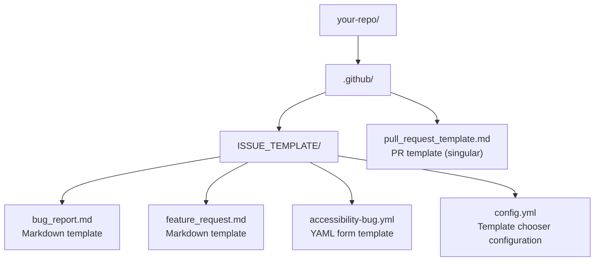

# Issue Templates
>
> **Listen to Episode 16:** [Issue Templates](../PODCASTS.md) - a conversational audio overview of this chapter. Listen before reading to preview the concepts, or after to reinforce what you learned.

## Structuring Contributions for Clarity and Quality

> Issue templates turn a blank text box into a guided form. They help contributors provide the information maintainers need, reduce back-and-forth, and make every issue immediately actionable. This guide teaches you what templates are, how to use the ones in `accessibility-agents`, and how to create your own - including an accessibility-specific bug report template.


## Prerequisites Checklist

### Before starting this chapter, verify you have completed

**Hard Requirements:**
- [ ] Chapter 4: [Working with Issues](04-working-with-issues.md) - Know how to create, read, and navigate issues
- [ ] A GitHub repository where you have write access (your fork or personal repo)
- [ ] A text editor with YAML syntax highlighting (VS Code, or any editor showing `.yml` files with color)

**Recommended (but not blocking):**
- [ ] Chapter 13: [GitHub Copilot](13-github-copilot.md) - Optional but helpful for generating template variations
- [ ] Chapter 9: [Notifications](09-notifications.md) - Basic understanding of workflow triggers
- [ ] Terminal/Command line basic comfort (useful but you can GitHub web editor if needed)

**What you already have:**
- [ ] You filled out the **Workshop Registration template** to join this workshop — this is your learning tool for Chapter 15

**Day 2 Amplifier:** In [Chapter 16 (Accessibility Agents)](16-accessibility-agents.md), you'll use `@template-builder` to automate template creation. Complete this chapter first, then come back to Chapter 16.

**Estimated time for this chapter:** 2-2.5 hours (including exercises and YAML troubleshooting time)


## Workshop Recommendation (Chapter 15)

Chapter 15 is a **template design and implementation chapter** focused on structuring contributions with a concrete, familiar example.

- **Challenge count:** 2-3 guided challenges
- **Automation check:** none (template structure quality is design-focused)
- **Evidence:** issue comment or PR with template remixed or created
- **Pattern:** analyze (a template you know) → remix (into a new context) → create (from scratch)

### Chapter 15 Guided Challenges (No Bot Validation)

For this workshop, Chapter 15 starts with a template you've already seen: the registration form you filled out to join the workshop. This is the perfect teaching tool because:

1. **You know what it does** — You filled it out and saw it work
2. **It shows YAML form templates** — More advanced than Markdown; uses structured fields
3. **Good accessibility design** — Demonstrates labeled form fields and validation

#### Challenge 1: Analyze the registration template

Understand how professional templates work by examining the one you already used:

**The Template:** [`.github/ISSUE_TEMPLATE/workshop-registration.yml`](https://github.com/community-access/git-going-with-github/blob/main/.github/ISSUE_TEMPLATE/workshop-registration.yml) — This is the form you filled out to register. It's a real, production template.

**What to Read:**
1. **YAML Frontmatter** (top 5 lines):
   - `name` → What appears in the template chooser
   - `description` → Helper text when users pick this template
   - `title` → Auto-fills the issue title
   - `labels` → Automatically adds labels to issues created with this template

2. **Field Types** (in the `body` section). Notice we use:
   - `type: markdown` → Display-only text (instructions)
   - `type: input` → Single-line text field (name, email)
   - `type: dropdown` → List of options (proficiency level, screen reader choice)
   - `type: textarea` → Multi-line text (questions/accommodations)

3. **Field Metadata**:
   - `id` → Internal identifier; doesn't display to user
   - `label` → What the user sees as the field name
   - `description` → Helper text explaining what to fill in
   - `placeholder` → Example text inside the field
   - `validations: required: true` → Marks a field as required

4. **Accessibility Thinking** (Search the file for "accessible") — Notice the description mentions that all fields work with screen readers. This is professional template thinking.

**Compare:** How is this different from a blank issue?
- Blank issue: massive empty text box, no guidance
- This template: structured fields, helpful descriptions, required/optional clarity

**Expected Outcome:** You can explain why templates reduce back-and-forth questions and make contribution easier.

### Worked Example: Remixing the Registration Template

Use this side-by-side pattern when you remix the registration template.

**Source sample:** [`.github/ISSUE_TEMPLATE/workshop-registration.yml`](../.github/ISSUE_TEMPLATE/workshop-registration.yml)

**Remix sample:** [`learning-room/docs/samples/chapter-15-registration-remix-example.yml`](../learning-room/docs/samples/chapter-15-registration-remix-example.yml)

What changes and what stays the same:

1. Keep the YAML skeleton (`name`, `description`, `title`, `labels`, `body`).
2. Keep field structure (`type`, `id`, `attributes`, `validations`).
3. Change context-specific content (labels, field names, descriptions, options).
4. Re-evaluate which fields must be required.

This is a remix workflow, not a from-scratch workflow.

#### Challenge 2: Remix the registration template for a new context

Take what you learned and adapt the registration template for a different use case:

- Pick a new context (e.g., bug report, event attendance, product research)
- Keep the same YAML structure and field types
- Change: title, labels, and field descriptions to match your new context
- Change: field names and options (e.g., `proficiency` → `experience`, or similar)
- Create a new file: `.github/ISSUE_TEMPLATE/my-template.yml`
- Validate YAML syntax before pushing (for example: <https://www.yamllint.com/>)
- Commit and push to a repository where you have write access

**Expected Outcome:** You can adapt a professional template to a new context without creating from scratch.

#### Challenge 3: Optional: Create a Markdown template

If you want to explore Markdown templates as well:

- Create a new file: `.github/ISSUE_TEMPLATE/my-markdown-template.md`
- Write Markdown-template frontmatter (`name`, `about`, `title`, `labels`) and note that this differs from YAML form templates (which use `description`)
- Add a Markdown body with 3-4 sections (e.g., Problem, Context, Solution Ideas)
- Include HTML comment instructions to guide contributors: `<!-- Instructions here -->`
- Commit and push

**Expected Outcome:** You can create both YAML form templates and Markdown templates.

#### Challenge 4: Test in the Template Chooser (Optional)

- Click "New Issue" in your test repository
- Verify your template appears in the chooser
- Click "Get started" and file a test issue using your template

**Expected Outcome:** Your template works and appears in the GitHub template picker.

### Expected Overall Outcomes

- Student understands template structure (YAML frontmatter, field types, validation)
- Student can analyze and remix professional templates
- Student can create both YAML form and Markdown templates
- Student understands why templates improve contribution quality
- Student can reduce maintainer effort through clear, guided contribution processes

### If You Get Stuck

1. **Can't find the registration template?** Look in `.github/ISSUE_TEMPLATE/workshop-registration.yml` — that's the form you filled out to register.
2. **YAML syntax confusing?** The registration template is a working example. Copy its structure and edit the field descriptions. YAML is just indented key-value pairs.
3. **YAML not parsing?** Compare with the remix sample in `learning-room/docs/samples/chapter-15-registration-remix-example.yml` and check indentation (2 spaces per level).
4. **Your template doesn't appear?** Verify: filename ends in `.yml` or `.md`, you pushed the commit, and file is in `.github/ISSUE_TEMPLATE/` folder.
5. **Testing in the template chooser isn't working?** Reload the Issues page, try a different repository, or ask facilitator for a test repository with write access.
6. **Remix approach feels overwhelming?** Start by changing just the field labels and descriptions. Don't change the structure yet.
7. Ask facilitator to review your template and suggest improvements.

### Learning Moment

Templates are scaffolding. They don't restrict expert contributors—they guide newcomers. A template that takes 2 minutes to understand saves 30 minutes of back-and-forth questions later. By remixing a professional template, you learned how to make templates work for your specific context. That's how maintainers decide if a new template is worth creating: they adapt existing patterns first, then innovate.


## Table of Contents

1. [What Is an Issue Template?](#1-what-is-an-issue-template)
2. [How Templates Work on GitHub](#2-how-templates-work-on-github)
3. [Navigating the Template Picker](#3-navigating-the-template-picker)
4. [The Accessibility Agents Issue Templates](#4-the-accessibility-agents-issue-templates)
5. [Creating a New Template - Step by Step](#5-creating-a-new-template---step-by-step)
6. [YAML Form-Based Templates](#6-yaml-form-based-templates)
7. [Building an Accessibility Bug Report Template](#7-building-an-accessibility-bug-report-template)
8. [Pull Request Templates](#8-pull-request-templates)
9. [Hands-On Activity](#9-hands-on-activity)


## 1. What Is an Issue Template?

An issue template is a pre-filled Markdown file that appears when someone activates "New Issue." Instead of an empty editor, the contributor sees:

- Instructions explaining what information is needed
- Section headers guiding them through the report
- Checkboxes for conditions to verify
- Placeholder text showing the expected format

### Why they matter for accessibility projects

Accessibility bugs require specific context that general bug templates often omit:

- Which screen reader and version?
- Which browser and version?
- Which operating system?
- Which WCAG success criterion is affected?
- Does the issue affect all users or only those with specific assistive technology?

Without this context, maintainers ask follow-up questions - which delays the fix and uses everyone's time. A good accessibility template captures it all on the first submission.


## 2. How Templates Work on GitHub

Templates live in a specific folder in your repository:

Templates live inside your-repo/.github/. The ISSUE_TEMPLATE/ subfolder contains: bug_report.md (Markdown template), feature_request.md (Markdown template), accessibility-bug.yml (YAML form template), and config.yml (template chooser configuration). The pull_request_template.md file sits directly in .github/, not inside ISSUE_TEMPLATE/.



**Markdown templates (`.md`):** Traditional template format. Pre-fills a text editor with structured Markdown content. Contributors edit the template directly, replacing instructions and placeholder text with their own content.

**YAML form templates (`.yml`):** Modern form-based templates. Creates a proper form interface with labeled fields, dropdowns, checkboxes, and validation. Contributors fill in fields rather than editing freeform Markdown. Better for accessibility because each field has an explicit label announced by screen readers.

**`config.yml`:** Controls the template chooser page - what templates appear, what their descriptions say, whether an external link (like a discussion forum) appears as an option, and crucially, **whether contributors can bypass templates entirely with a blank issue**.

For accessibility projects, `config.yml` is important: disabling the blank issue option means every report arrives with the structure your project needs. A screen reader bug report without reproduction steps and AT version information is almost impossible to triage - the form prevents that by making those fields required.

### Example `config.yml`

```yaml
blank_issues_enabled: false
contact_links:
  - name: Community Discussion
    url: https://github.com/community-access/accessibility-agents/discussions
    about: For questions and general discussion - not bugs
  - name: Security Vulnerability
    url: https://github.com/community-access/accessibility-agents/security/advisories/new
    about: Please use private reporting for security issues
```

With `blank_issues_enabled: false`, the "Open a blank issue" link disappears from the template chooser. Contributors must use one of your structured templates or one of the contact links. This is one of the most effective ways to improve the quality of incoming issues in any project you maintain.


## 3. Navigating the Template Picker

When a repository has multiple templates, GitHub shows a template chooser page before the issue editor.

<details>
<summary>Visual / mouse users</summary>

1. Click the **Issues** tab on any repository
2. Click the **New issue** button
3. The template chooser page loads - templates appear as cards with a title, description, and "Get started" button
4. Click **"Get started"** on the template you want
5. The issue editor opens with that template's content pre-filled

</details>

<details>
<summary>Screen reader users - NVDA / JAWS (Windows)</summary>

1. Navigate to the Issues tab (press `T` from the repository tabs landmark)
2. Activate "New issue" button
3. The template chooser page loads
4. Each template appears as a list item or a link
5. Use `Tab` to move between templates
6. Each template shows: name, description, "Get started" button
7. Activate "Get started" on your chosen template

</details>

<details>
<summary>Screen reader users - VoiceOver (macOS)</summary>

1. Navigate to the Issues tab (`VO+Right` from the tab bar landmark)
2. `VO+Space` to activate "New issue"
3. The chooser page loads - templates appear as list items
4. `VO+Right` to move between templates
5. `VO+Space` on "Get started" for your chosen template

</details>

**Note:** GitHub's improved Issues experience provides proper keyboard accessibility for the template chooser. This feature may already be active in your account.

### Bypassing the Chooser

If you want to file an issue without using a template:

- Scroll past all templates to the bottom of the chooser page
- Activate "Open a blank issue"


## 4. The Accessibility Agents Issue Templates

Accessibility Agents uses templates to structure contributions. Navigate to `.github/ISSUE_TEMPLATE/` in the repository to read them.

<details>
<summary>Visual / mouse users</summary>

1. Click the **Code** tab on the repository
2. Click the `.github` folder in the file listing
3. Click `ISSUE_TEMPLATE`
4. You'll see the template files - click any to read it

</details>

<details>
<summary>Screen reader users (NVDA / JAWS / VoiceOver)</summary>

1. Open the Code tab
2. Use `Ctrl+Alt+Down/Up` (NVDA/JAWS) or `VO+Arrow` (VoiceOver) in the files table to reach the `.github` folder
3. Activate the folder
4. Activate `ISSUE_TEMPLATE`
5. You will see the template files listed

</details>

### Reading a Template File

Open any template file (e.g., `bug_report.md`) in VS Code or in the GitHub web editor (pencil button - screen readers announce it as "Edit this file").

Look for:

- **Frontmatter** (between `---` delimiters): name, about, title, labels, assignees
- **Body**: The template content with `##` headings, `<!-- -->` HTML comments as instructions, and placeholder text

#### Example frontmatter

```yaml
name: Bug Report
about: Report a problem with an agent or prompt
title: '[BUG] '
labels: bug
assignees: ''
```

The `about` text appears in the template chooser. The `title` pre-fills the issue title field (the contributor replaces the placeholder). The `labels` array auto-applies labels when the issue is created.


## 5. Creating a New Template - Step by Step

### Choosing Between Markdown and YAML Templates

Before creating a template, decide which format best suits your needs:

| Factor | Markdown Templates | YAML Form Templates |
| --------  | -------------------  | ---------------------  |
| **Best for** | Simple templates, freeform text | Structured data collection, accessibility |
| **Complexity** | Very simple to create | More complex, requires YAML knowledge |
| **Screen reader UX** | Announces as pre-filled text editor | Announces each field with explicit labels |
| **Validation** | None - contributors can delete anything | Can mark fields as required, validate input |
| **Flexibility** | Full Markdown formatting freedom | Limited to defined field types |
| **Data consistency** | Varies - contributors may skip sections | High - dropdowns ensure consistent values |
| **Learning curve** | Minimal | Moderate |
| **Maintenance** | Easy - just edit Markdown | More involved - must update YAML structure |

#### Use Markdown templates when

- You want contributors to have maximum flexibility in how they write
- The template is primarily instructional text with minimal structured data
- Your contributor base is comfortable with Markdown
- You don't need validation or required fields

#### Use YAML form templates when

- You need specific, structured information (OS, browser, version numbers)
- You want to guide less experienced contributors with dropdowns and validation
- Screen reader accessibility is critical (labeled form fields are more accessible)
- You want to ensure data consistency for automated triage or analysis
- You need required fields that contributors cannot skip

**For accessibility projects:** YAML form templates are strongly recommended. Accessibility bug reports require specific context (screen reader, browser, OS, version numbers) that Markdown templates rely on contributors to remember. Form templates make these fields explicit and required.


### Markdown Template Structure

A Markdown template consists of two parts:

**1. YAML Frontmatter** (between `---` delimiters)

Defines metadata about the template:

```yaml
name: Bug Report                    # Name shown in template chooser
about: Report a bug or error        # Description in template chooser
title: '[BUG] '                     # Pre-filled issue title (user can edit)
labels: ['bug', 'needs-triage']     # Auto-applied labels
assignees: ''                       # Auto-assigned maintainers (optional)
```

#### 2. Markdown Body

The template content that pre-fills the issue editor:

```markdown
## Describe the Bug
A clear and concise description of what the bug is.

## Steps to Reproduce
1. Go to '...'
2. Click on '...'
3. Scroll down to '...'
4. See error

## Expected Behavior
What you expected to happen.

## Actual Behavior
What actually happened.

## Environment
- **OS:** [e.g. Windows 11, macOS Sonoma]
- **Browser:** [e.g. Chrome 124, Firefox 125]
- **Screen Reader:** [e.g. NVDA 2025.3.3, VoiceOver]

## Additional Context
Add any other context about the problem here.
```

### Markdown template tips

- Use `##` headings to create clear sections
- Use HTML comments `<!-- like this -->` for instructions that shouldn't appear in final issue
- Use `**Bold text**` for field names to make them stand out
- Use bullet lists or numbered lists for checklists
- Be specific: "Browser version (e.g. Chrome 124)" is better than "Browser"
- Include examples in brackets: `[e.g. ...]` helps contributors understand format


### Complete Markdown Template Example

Here's a complete accessibility bug report template in Markdown format. Save this as `.github/ISSUE_TEMPLATE/accessibility-bug-simple.md`:

```markdown
name: Accessibility Bug (Markdown)
about: Report an accessibility issue using the simple Markdown template
title: '[A11Y] '
labels: ['accessibility', 'needs-triage']
assignees: ''

<!-- 
Thank you for reporting an accessibility issue. Please fill in all sections below.
Screen reader and browser information is especially important for us to reproduce the issue.
-->

## Component Affected

<!-- Which agent, slash command, or feature has the accessibility issue? -->

- [ ] @daily-briefing
- [ ] @issue-tracker
- [ ] @pr-review
- [ ] @analytics
- [ ] @insiders-a11y-tracker
- [ ] Slash command (specify below)
- [ ] Documentation
- [ ] Setup or configuration
- [ ] Other: ___________

## Your Assistive Technology Setup

**Screen Reader:** [e.g. NVDA 2025.3.3, JAWS 2026, VoiceOver macOS Sonoma]  
**Browser:** [e.g. Chrome 124, Firefox 125, Safari 17]  
**Operating System:** [e.g. Windows 11, macOS Sonoma 14.3, Ubuntu 22.04]  
**Keyboard only (no screen reader):** [ ] Yes  [ ] No

## Expected Behavior

<!-- What should happen? What should your screen reader announce? -->


## Actual Behavior

<!-- What actually happens? What does your screen reader announce (or not announce)? -->


## Steps to Reproduce

1. 
2. 
3. 
4. Result: 

## WCAG Success Criterion (if known)

<!-- Which WCAG guideline does this violate? Leave blank if unsure. -->

- [ ] 1.1.1 Non-text Content
- [ ] 1.3.1 Info and Relationships
- [ ] 2.1.1 Keyboard
- [ ] 2.4.3 Focus Order
- [ ] 2.4.6 Headings and Labels
- [ ] 4.1.2 Name, Role, Value
- [ ] Other: ___________
- [ ] Not sure

## Additional Context

<!-- Screenshots (with alt text), links to related issues, workarounds, or suggested fixes -->


## Before Submitting

- [ ] I searched for existing issues and this is not a duplicate
- [ ] I can reliably reproduce this issue with the steps above
- [ ] I have included my screen reader and browser versions
```

### When to use this Markdown version instead of YAML

- Your contributors are comfortable with Markdown and prefer editing text
- You want contributors to have more freedom in how they structure their report
- The template is for an internal project where you know all contributors
- You want a simpler template that's easier to modify later

### Markdown template accessibility considerations

- Checkboxes use `- [ ]` syntax (Markdown task lists)
- Instructions are in HTML comments `<!-- -->` so they don't clutter the final issue
- Bracket placeholders `[e.g. ...]` show expected format
- Section headings use `##` for clear document structure
- Screen readers can navigate by heading through the template


### Creating Markdown Templates: The Manual Workflow (Browser)

<details>
<summary>Visual / mouse users</summary>

1. Navigate to your fork of `accessibility-agents` on GitHub
2. Click the **Settings** tab
3. Scroll to the "Features" section → click the checkmark next to "Issues" → click **"Set up templates"**
4. Or navigate directly to `.github/ISSUE_TEMPLATE/` in your fork → click the `+` button → "Create new file"
5. GitHub opens a template editor. Fill in the template name, about description, and body
6. GitHub auto-populates the filename - you can change it
7. Click **"Propose changes"** → create a PR to add the template

</details>

<details>
<summary>Screen reader users (NVDA / JAWS / VoiceOver)</summary>

1. Navigate to your fork of `accessibility-agents` on GitHub
2. Go to the Settings tab (press `T` from the tabs landmark, then navigate to "Settings")
3. Scroll to the "Features" section → find "Issues" → activate "Set up templates"

   *Alternative:* Navigate directly to `.github/ISSUE_TEMPLATE/` → activate the "+" button → "Create new file"

4. GitHub opens a template editor. Fill in:
   - Template name: what appears in the chooser heading
   - About: the description in the chooser
   - Template content: the Markdown body
5. GitHub auto-populates the filename based on your template name
6. "Propose changes" → create a PR to add the template

</details>

### Creating Markdown Templates: The VS Code Workflow

1. Open your `accessibility-agents` fork in VS Code
2. Navigate in Explorer to `.github/ISSUE_TEMPLATE/`
3. Create a new file: `Ctrl+N` → save as `your-template-name.md` in that folder
4. Add frontmatter first (between `---` delimiters), then the body
5. Commit and push: open Source Control (`Ctrl+Shift+G`) → stage → commit → push

#### File naming conventions

- Use lowercase with hyphens: `accessibility-bug.md`, `feature-request.md`
- Be descriptive: `security-vulnerability.md` is better than `security.md`
- Avoid spaces in filenames


## 6. YAML Form-Based Templates

YAML templates create a proper form interface - labeled fields, dropdowns, checkboxes - rather than a pre-filled text editor. This is the preferred format for modern GitHub projects, especially those focused on accessibility.

### Why YAML Forms Are Better for Accessibility

**Explicit labels:** Each field has a `label:` that screen readers announce. In Markdown templates, users must infer structure from headings and placeholder text.

**Structured navigation:** Screen readers can navigate form fields with standard form navigation commands (`F` key in NVDA/JAWS, form controls in VoiceOver rotor).

**Required field validation:** Screen readers announce when a field is required before the user submits. Markdown templates have no validation.

**Consistent data:** Dropdowns provide options that screen readers can navigate (`Up/Down Arrow` to hear each choice). contributors don't have to guess valid values.

**Skip unreadable instructions:** HTML comments in Markdown templates (`<!-- -->`) can confuse some screen reader configurations. YAML `markdown` fields provide instruction text that renders as readable content, not editing noise.


### YAML Template Structure

A YAML form template consists of several parts:

```yaml
name: Issue Template Name         # Shows in template chooser
description: Longer description   # Shows in template chooser
title: "[TAG] "                   # Pre-filled issue title
labels: ["label1", "label2"]      # Auto-applied labels
assignees: ["username"]           # Auto-assigned (optional)
body:                             # Array of form fields
  - type: markdown
    attributes:
      value: |
        Instructional text here

  - type: input
    id: unique-field-id
    attributes:
      label: Field Label
      description: Help text under the label
      placeholder: Placeholder text in the field
    validations:
      required: true
```

#### Top-level keys

- `name` (required): Template name in chooser
- `description` (required): Template description in chooser
- `title` (string): Pre-fills issue title, contributor can edit
- `labels` (array): Labels auto-applied when issue is created
- `assignees` (array): Usernames auto-assigned when issue is created
- `body` (array): The form fields (required)


```yaml
name: Accessibility Bug Report
description: Report an accessibility issue in Accessibility Agents' output or interface
title: "[A11Y] "
labels: ["accessibility", "needs-triage"]
body:
  - type: markdown
    attributes:
      value: |
        Thank you for reporting an accessibility issue.
        Please fill in as much detail as possible.

  - type: dropdown
    id: screen-reader
    attributes:
      label: Screen Reader
      description: Which screen reader are you using?
      options:
        - NVDA (Windows)
        - JAWS (Windows)
        - VoiceOver (macOS)
        - VoiceOver (iOS)
        - TalkBack (Android)
        - Narrator (Windows)
        - Orca (Linux)
        - None
    validations:
      required: true

  - type: checkboxes
    id: checked-existing
    attributes:
      label: Before Submitting
      options:
        - label: I searched for existing issues and this is not a duplicate
          required: true
        - label: I am using the modern GitHub Issues experience (default since Jan 2026)
          required: false
```

### YAML Field Types Reference

GitHub supports several field types in YAML form templates. Each has specific attributes and uses:

#### 1. `markdown` - Instructional Text

Displays formatted Markdown content. Not editable by the contributor. Use for instructions, warnings, or explanations.

```yaml
- type: markdown
  attributes:
    value: |
      ## Before You Begin

      Please search for [existing issues](../issues) before submitting.
      Use this format for multi-line text.
```

##### Attributes

- `value` (required): Markdown content to display. Use `|` for multi-line text.

**No validation options** (static content)

**Screen reader note:** This content is announced as regular text. Screen reader users can read it with their reading commands before moving to the next field.


#### 2. `input` - Single-line Text Field

A single-line text input. Best for short answers like version numbers, URLs, or names.

```yaml
- type: input
  id: version
  attributes:
    label: Version Number
    description: Which version of the software are you using?
    placeholder: e.g., v2.4.1
  validations:
    required: true
```

##### Attributes

- `label` (required): Field label, announced by screen readers
- `description` (optional): Help text below the label
- `placeholder` (optional): Placeholder text inside the field

##### Validations

- `required` (boolean): Whether the field must be filled

**Screen reader announcement:** "Version Number, required, edit text, Which version of the software are you using?"


#### 3. `textarea` - Multi-line Text Area

A multi-line text input. Best for descriptions, reproduction steps, code snippets, or any long-form content.

```yaml
- type: textarea
  id: description
  attributes:
    label: Describe the Issue
    description: Provide as much detail as possible
    placeholder: |
      When I navigate to...
      The screen reader announces...
      I expected...
    value: |
      This text pre-fills the textarea.
      Contributors can edit or replace it.
    render: markdown
  validations:
    required: true
```

##### Attributes

- `label` (required): Field label
- `description` (optional): Help text
- `placeholder` (optional): Placeholder text (multi-line with `|`)
- `value` (optional): Pre-filled content (multi-line with `|`)
- `render` (optional): Syntax highlighting hint (e.g., `markdown`, `python`, `javascript`)

##### Validations

- `required` (boolean): Whether the field must be filled

**Accessibility tip:** Use `placeholder` for examples, `value` for pre-filled template text that contributors should edit.


#### 4. `dropdown` - Select Menu

A dropdown menu with predefined options. Contributors select one choice. Best for bounded answer spaces like OS, browser, or severity.

```yaml
- type: dropdown
  id: browser
  attributes:
    label: Browser
    description: Which browser are you using?
    options:
      - Google Chrome
      - Mozilla Firefox
      - Microsoft Edge
      - Apple Safari
      - Other
    multiple: false
  validations:
    required: true
```

##### Attributes

- `label` (required):Field label
- `description` (optional): Help text
- `options` (required): Array of choices (strings)
- `multiple` (boolean, default `false`): Whether user can select multiple options

##### Validations

- `required` (boolean): Whether a selection is required

##### Screen reader experience

1. Field is announced as "Browser, required, combo box"
2. Press `Down Arrow` or `Alt+Down` to expand the dropdown
3. `Up/Down Arrow` to navigate options
4. Screen reader announces each option
5. `Enter` or `Space` to select

**Accessibility note:** Dropdowns are more accessible than free text for bounded choices. Screen reader users can hear all options and select precisely.


#### 5. `checkboxes` - Checkbox Group

A group of checkboxes. Contributors can select multiple options or use as a verification checklist.

```yaml
- type: checkboxes
  id: prerequisites
  attributes:
    label: Before Submitting
    description: Please verify these items
    options:
      - label: I searched for existing issues
        required: true
      - label: I can reproduce this issue reliably
        required: true
      - label: I have attached relevant logs or screenshots
        required: false
```

##### Attributes

- `label` (required): Group label
- `description` (optional): Group description
- `options` (required): Array of checkbox objects

##### Each checkbox option

- `label` (required): Checkbox label (what the user sees)
- `required` (boolean, default `false`): Whether this checkbox must be checked

**No top-level validation** - validation is per-checkbox in `options`

##### Screen reader experience

1. Group label announced: "Before Submitting, Please verify these items"
2. Each checkbox announced as "I searched for existing issues, checkbox, not checked, required"
3. Screen reader users can check each box with `Space`

**Accessibility note:** Checkboxes with `required: true` prevent submission if unchecked. This enforces contribution guidelines (e.g., "search for duplicates first").


### YAML Field Types Summary Table

| Type | Best For | Key Attributes | Validations | Screen Reader Announced As |
| ------  | ----------  | ----------------  | -------------  | ----------------------------  |
| `markdown` | Instructions, warnings, explanations | `value` | None | Regular text content |
| `input` | Version numbers, URLs, short text | `label`, `placeholder` | `required` | "Edit text" or "Edit" |
| `textarea` | Descriptions, steps, code, long text | `label`, `placeholder`, `render` | `required` | "Multi-line edit" or "Text area" |
| `dropdown` | OS, browser, severity, bounded choices | `label`, `options`, `multiple` | `required` | "Combo box" or "Pop-up button" |
| `checkboxes` | Verification lists, multiple selections | `label`, `options` with per-item `required` | Per-checkbox | "Checkbox, not checked" |

#### Choosing the right field type

- If the answer is one of 2-10 known values → `dropdown`
- If the answer is a short string (1-2 words) → `input`
- If the answer is multiple sentences or a code block → `textarea`
- If the contributor must verify multiple conditions → `checkboxes` with `required: true`
- If you need to explain something → `markdown`


## 7. Building an Accessibility Bug Report Template

This is the hands-on activity. You will create a YAML form template specifically for accessibility bug reports in `accessibility-agents`.

### Full Template

Save this as `.github/ISSUE_TEMPLATE/accessibility-bug.yml` in your fork:

```yaml
name: Accessibility Bug Report
description: Report an issue where Accessibility Agents output or behavior is not accessible to screen reader users or keyboard-only users
title: "[A11Y] "
labels: ["accessibility", "needs-triage"]
body:
  - type: markdown
    attributes:
      value: |
        ## Thank You for This Report

        Accessibility bug reports are some of the most important contributions
        this project receives. The more detail you provide, the faster we can
        reproduce and fix the issue.

        **Before submitting:** Please check existing issues to avoid duplicates.
        You can search: `is:open is:issue label:accessibility`

  - type: dropdown
    id: component
    attributes:
      label: Which Agent or Feature Is Affected?
      options:
        - "@daily-briefing"
        - "@issue-tracker"
        - "@pr-review"
        - "@analytics"
        - "@insiders-a11y-tracker"
        - "A slash command (specify below)"
        - "Documentation"
        - "Setup or configuration"
        - "Other"
    validations:
      required: true

  - type: dropdown
    id: screen-reader
    attributes:
      label: Screen Reader
      description: Which screen reader are you using? Select all that apply by filing separate issues, or list multiple in "Additional Context" below.
      options:
        - NVDA (Windows)
        - JAWS (Windows)
        - VoiceOver (macOS)
        - VoiceOver (iOS / iPadOS)
        - TalkBack (Android)
        - Narrator (Windows)
        - Orca (Linux)
        - Keyboard only (no screen reader)
        - None of the above
    validations:
      required: true

  - type: input
    id: screen-reader-version
    attributes:
      label: Screen Reader Version
      description: For example, "NVDA 2025.3.3" or "JAWS 2026"
      placeholder: e.g., NVDA 2025.3.3
    validations:
      required: false

  - type: dropdown
    id: browser
    attributes:
      label: Browser
      options:
        - Google Chrome
        - Microsoft Edge
        - Mozilla Firefox
        - Apple Safari
        - Other
    validations:
      required: true

  - type: input
    id: browser-version
    attributes:
      label: Browser Version
      placeholder: e.g., Chrome 124.0.6367.82

  - type: dropdown
    id: os
    attributes:
      label: Operating System
      options:
        - Windows 11
        - Windows 10
        - macOS Sequoia
        - macOS Sonoma
        - macOS Ventura
        - iOS / iPadOS
        - Android
        - Linux
        - Other
    validations:
      required: true

  - type: textarea
    id: expected
    attributes:
      label: Expected Behavior
      description: What should happen? What should your screen reader announce?
      placeholder: |
        When I activate the "Get started" button, my screen reader should announce
        "Issue template: Accessibility Bug Report, heading level 2" and move
        focus to the first form field.
    validations:
      required: true

  - type: textarea
    id: actual
    attributes:
      label: Actual Behavior
      description: What actually happens? What does your screen reader announce (or not announce)?
      placeholder: |
        When I activate the "Get started" button, focus moves but my screen reader
        announces nothing. I have to navigate manually to find where I am.
    validations:
      required: true

  - type: textarea
    id: steps
    attributes:
      label: Steps to Reproduce
      description: Numbered steps to reproduce the issue
      placeholder: |
        1. Navigate to accessibility-agents on GitHub
        2. Activate "New issue"
        3. On the template chooser, Tab to "Accessibility Bug Report"
        4. Activate "Get started"
        5. Result: [what happens]
    validations:
      required: true

  - type: dropdown
    id: wcag
    attributes:
      label: WCAG Success Criterion (if known)
      description: Which accessibility standard does this appear to violate?
      options:
        - "1.1.1 Non-text Content"
        - "1.3.1 Info and Relationships"
        - "1.3.2 Meaningful Sequence"
        - "1.4.1 Use of Color"
        - "1.4.3 Contrast (Minimum)"
        - "2.1.1 Keyboard"
        - "2.1.2 No Keyboard Trap"
        - "2.4.1 Bypass Blocks"
        - "2.4.3 Focus Order"
        - "2.4.6 Headings and Labels"
        - "2.4.7 Focus Visible"
        - "3.3.1 Error Identification"
        - "4.1.2 Name, Role, Value"
        - "4.1.3 Status Messages"
        - "Not sure"
        - "Does not apply"
    validations:
      required: false

  - type: textarea
    id: context
    attributes:
      label: Additional Context
      description: Anything else - screenshots (with alt text), links to related issues, workarounds you found, or suggestions for a fix

  - type: checkboxes
    id: checklist
    attributes:
      label: Before Submitting
      options:
        - label: I searched existing issues and this is not a duplicate
          required: true
        - label: I can reliably reproduce this issue with the steps above
          required: true
        - label: I have included my screen reader and browser versions
          required: false
```

### What Makes This Template Accessible

This template is itself an accessibility contribution:

- Every dropdown limits input to valid options, reducing errors for all users
- The "Before Submitting" checklist uses explicit checkbox labels, not just text
- The textarea placeholders model the format of a good answer, not just describe it
- The WCAG dropdown educates as it collects data
- The "Additional Context" field is optional - a contributor with limited time can still file a useful report without this field


### A Second Template: Feature Request Form

The bug report template above is specific to accessibility issues. Once you understand the pattern, you can create templates for any contribution type. Here is a Feature Request template you can add to your own projects - it follows the exact same YAML structure.

Save as `.github/ISSUE_TEMPLATE/feature-request.yml`:

```yaml
name: Feature Request
description: Suggest a new agent, slash command, or improvement to Accessibility Agents
title: "[FEAT] "
labels: ["enhancement", "needs-triage"]
body:
  - type: markdown
    attributes:
      value: |
        ## Suggest a Feature

        Feature requests are welcome. The more specific your suggestion,
        the easier it is to design and implement.

  - type: dropdown
    id: feature-area
    attributes:
      label: Feature Area
      description: Which part of Accessibility Agents does this relate to?
      options:
        - New agent
        - New slash command
        - Existing agent improvement
        - Output format / accessibility
        - Documentation
        - Configuration / preferences
        - Other
    validations:
      required: true

  - type: textarea
    id: problem
    attributes:
      label: Problem or Gap
      description: What is the problem you are trying to solve? What can you not currently do?
      placeholder: |
        I often need to... but there is no way to...
        I find that the current output of @daily-briefing does not...
    validations:
      required: true

  - type: textarea
    id: solution
    attributes:
      label: Proposed Solution
      description: How would you like this to work?
      placeholder: |
        A new slash command called /weekly-digest that...
        The @pr-review agent should additionally announce...
    validations:
      required: true

  - type: textarea
    id: accessibility-impact
    attributes:
      label: Accessibility Considerations
      description: How does this feature affect screen reader users or keyboard-only navigation?
      placeholder: |
        This would improve the experience because...
        Screen reader users would benefit by...

  - type: checkboxes
    id: checklist
    attributes:
      label: Before Submitting
      options:
        - label: I searched existing issues and discussions - this has not been suggested before
          required: true
        - label: This feature would benefit contributors beyond my personal workflow
          required: false
```

**Why this matters for your own projects:** Every open source project you create or maintain can have issue templates. A project with good templates gets better bug reports and feature requests - which means less back-and-forth and faster, more confident triage. The templates you create here are skills you carry to every repository you own.


### Designing Templates for Your Own Projects

When designing templates for a project you maintain, use these principles:

**Ask for the minimum that makes the report actionable.** Every optional field you add is a reason for a contributor with limited time to stop and not finish. Required fields should be information you genuinely cannot triage without.

**Use dropdowns over free text when the answer space is bounded.** "Which operating system?" should be a dropdown, not a text field. Bounded dropdowns reduce typos, inconsistent labeling, and fields left blank.

**Write textarea placeholders as examples, not instructions.** A placeholder that says "e.g., When I navigate to the Issues tab using NVDA in Chrome on Windows 11..." teaches the contributor what a good answer looks like. A placeholder that says "Describe the issue here" does not.

**Include a pre-submission checklist.** Even one checkbox - "I searched for existing issues" - reduces duplicate reports significantly. The checklist also reinforces community norms: the act of checking a box is more memorable than reading a line of text.

**Test every template with your screen reader before committing.** Navigate through the form, tab through all fields, confirm every label is announced correctly, and verify that required-field errors are surfaced in a way a screen reader user will encounter before submitting.


## 8. Pull Request Templates

A pull request template appears as the default body of every new PR in your repository.

**File location:** `.github/pull_request_template.md` (singular - only one PR template per repo)

### Reading the Accessibility Agents PR Template

Open `.github/pull_request_template.md` in VS Code. You will see the standard sections the project expects:

```markdown
## Description
<!-- What does this PR add or fix? Why? -->

## Type of Change
- [ ] New agent
- [ ] New slash command
- [ ] Bug fix
- [ ] Documentation improvement
- [ ] Accessibility improvement
- [ ] Other (describe below)

## How to Test
<!-- How can a reviewer verify this works correctly? -->

## Accessibility Considerations
<!-- Does this change affect screen reader output? WCAG compliance?
     Keyboard navigation? If yes, describe what was tested. -->

## Related Issues
<!-- Use "Closes #N" to auto-close the issue when this PR is merged -->
```

**Using it when opening a PR:** The template auto-fills the PR description field. Tab through the sections with your screen reader and fill in each one. Delete placeholder comments (`<!-- ... -->`) - they will not appear in the rendered PR but can confuse screen readers if left in.


## 9. Hands-On Activity

### Exercise A - Use an Existing Template

**Your Mission:** File your first issue using a structured template. You'll experience the template as an end-user, which teaches you what good template design feels like.

**What You'll Learn:** How templates guide contributors, what fields are required vs optional, and whether screen reader announced all fields clearly.


#### Step 1: Navigate to the Accessibility Agents Issues Section

##### What to do

1. Open GitHub in your browser
2. Navigate to the `community-access/accessibility-agents` repository (or your fork)
3. Click the **Issues** tab (top navigation, between Pull Requests and Discussions)
4. You should see a list of existing issues

##### What you should see

- A tab labeled "Issues" (currently active)
- A list of open/closed issues below
- A large green button labeled **"New issue"** on the right side

1. Click the **"New issue"** button

##### If you can't find it

- Go directly to: `https://github.com/community-access/accessibility-agents/issues/new`
- This opens the issue template chooser


#### Step 2: View the Template Chooser with Your Screen Reader

##### What to do

1. You should now see a **Template Chooser** page
2. The page displays available templates as buttons or links
3. **With screen reader:** Navigate through the templates:
   - NVDA/JAWS: Press `Tab` to move between templates, `Enter` to select one
   - VoiceOver: Use `VO+Right Arrow` to move between elements, then `VO+Space` to activate
4. Count the templates and read their descriptions aloud (or write them down):
   - Template 1: [name] - [description]
   - Template 2: [name] - [description]
   - And so on...

##### What you're listening for

- Is each template name announced clearly?
- Does the description explain what the template is for?
- Is the UI structured so you don't accidentally skip a template?

##### Write down

- How many templates are available?
- Which one seems closest to issues you identified on Day 1?


#### Step 3: Select a Template

##### What to do

1. **Choose the template closest to a real issue type you identified on Day 1** (e.g., if you noted "screen reader navigation bug," select the Accessibility Bug Report template)
2. Click it (or press `Enter` if focused with keyboard)

##### What happens

- The issue form opens
- You see a form with labeled fields
- Each field is pre-filled with helpful prompts or instructions

##### If no template matches exactly

- Choose **"Blank Issue"** or the most general template
- You'll learn what an unstructured issue looks like (which teaches the *value* of templates)


#### Step 4: Navigate the Form Fields

##### What to do

1. The issue form is now open
2. Navigate through all visible fields using your screen reader or by tabbing:
   - **NVDA/JAWS:** Press `Tab` to move to the next field, `Shift+Tab` to go back
   - **VoiceOver:** Use `VO+Down Arrow` to read fields in order
3. For each field, note:
   - Field label (announced by screen reader)
   - Help text or placeholder (hints about what to enter)
   - Whether it's marked as required (usually with a red `*` or the word "required")
4. **Write down at least 3 fields and whether each is required:**
   - Field: [name] - Required? [Yes/No]


#### Step 5: Fill In the Form

##### What to do

1. **Fill in at least 3 fields** with realistic content based on an issue you identified on Day 1
   - Example: If the template asks "Screen Reader," select "NVDA"
   - If it asks "Steps to reproduce," write 2-3 specific steps
2. **For required fields marked with `*`:** Fill them in completely
3. **For optional fields:** Choose at least one and fill it in (so you test optional fields)
4. Don't worry about filling in *every* field - the point is to test the form

##### What to expect

- As you fill fields, you may see tooltips or error messages if you make a mistake
- Some fields may change based on your selection (e.g., choosing a component shows related sub-options)


#### Step 6: Preview the Issue Before Submitting

##### What to do

1. Look for a **Preview** tab or button (usually near the top of the form, next to "Write" or "Markdown")
2. Click it (or press the hotkey shown)
3. A preview pane appears showing how the issue will look when published

##### With screen reader

- NVDA/JAWS: Navigate to the preview area with `D` (region landmark)
- VoiceOver: Use `VO+Right Arrow` to find the main content region
- Read through the preview to confirm fields are formatted correctly

##### What to look for

- Are all the fields you filled in visible in the preview?
- Are headings and section labels clear?
- Would another person understand what you're reporting?
- **If you use a screen reader:** Are all labels announced correctly in the preview?

##### If something is unclear

- Go back to the "Write" tab
- Edit the fields
- Preview again


#### Step 7: Submit the Issue

##### What to do

1. Once you're satisfied with the preview, go back to the "Write" tab
2. Locate the green **"New issue"** button (usually at the bottom of the form)
3. **With keyboard:** Press `Tab` until the button is focused, then `Enter`
4. **With mouse:** Click the button
5. The issue is submitted and you see the new issue page with your content

##### What happens

- You see a confirmation: the issue is now live in the repository
- The issue number appears (e.g., "#123")
- Your issue is visible to all repository members


#### Step 8: Checkpoint - Reflect on the Template

After submitting, answer:

1. **Template Clarity:** Did the template guide you toward providing useful information, or did fields feel confusing or unnecessary?
2. **Screen Reader Accessibility:** Were all field labels announced clearly? Did you encounter any accessibility barriers?
3. **Required vs Optional:** Was it obvious which fields were required? If you skipped an optional field, would you have known it was optional?
4. **Context Helpfulness:** Did the placeholder text or help text under each field make you understand what information to provide?

**Record these answers.** You'll use them in Exercise D when you design your own template.


### Exercise B - Add the Accessibility Bug Report Template to Your Fork

**Your Mission:** Create your own instance of the accessibility bug report template in your personal fork. This teaches you the file structure and gives you hands-on experience with YAML syntax.

**What You'll Learn:** How templates are stored as files, what YAML syntax looks like, and how to test templates locally.

**Prerequisites:**

- You have already read Section 7 thoroughly (Building an Accessibility Bug Report Template)
- You have a fork of `accessibility-agents` (created on Day 1)
- VS Code is installed on your machine
- Git is installed and configure with your GitHub credentials


#### Step 1: Clone Your Fork to Your Machine

##### What to do

1. Open a terminal (PowerShell on Windows, Terminal on macOS/Linux)
2. Navigate to a folder where you want to store the project:

   ```bash
   cd ~/projects
   ```

   (Or wherever you keep code projects)
3. Clone your fork:

   ```bash
   git clone https://github.com/[YOUR-USERNAME]/accessibility-agents.git
   ```

   Replace `[YOUR-USERNAME]` with your actual GitHub username
4. Wait for the clone to complete (should take 10-30 seconds)
5. Navigate into the folder:

   ```bash
   cd accessibility-agents
   ```

##### What you should see

- The terminal shows the folder structure being downloaded
- Once complete, the prompt returns to `accessibility-agents $` or similar
- You are now inside your local fork

##### If you get an error

- "Repository not found" → Make sure your GitHub username is correct
- "Permission denied" → You may need to set up SSH keys (see [GitHub Docs: SSH Keys](https://docs.github.com/en/authentication/connecting-to-github-with-ssh))


#### Step 2: Open Your Fork in VS Code

##### What to do

1. From the terminal, while in your `accessibility-agents` folder, type:

   ```bash
   code .
   ```

2. Press Enter
3. VS Code opens with your fork loaded

##### What you should see

- VS Code opens a new window
- The left sidebar shows the folder structure of `accessibility-agents`
- At the top, you see the folder name: `accessibility-agents`

##### If `code .` doesn't work

- Use VS Code's File menu: **File** → **Open Folder** → navigate to your `accessibility-agents` folder


#### Step 3: Navigate to the Templates Folder

##### What to do

1. In VS Code's file tree (left sidebar), expand the `.github` folder
2. Inside, find and expand the `ISSUE_TEMPLATE` folder
3. You should see existing template files (like `bug-report-template.yml` or similar)

##### What you're looking at

- Each `.yml` file is an issue template
- These are the templates you saw in the GitHub UI when you filed an issue in Exercise A

##### If the folder doesn't exist

- Right-click on the `.github` folder and select **New Folder**
- Name it `ISSUE_TEMPLATE`


#### Step 4: Create a New Template File

##### What to do

1. Right-click on the `ISSUE_TEMPLATE` folder
2. Select **New File**
3. Name it: `accessibility-bug.yml` (exactly this name)
4. Press Enter

##### What happens

- A new, empty file opens in the editor
- The cursor is ready for you to start typing


#### Step 5: Copy the Accessibility Template YAML

##### What to do

1. Go to [Chapter 15, Section 7](15-issue-templates.md#7-building-an-accessibility-bug-report-template) in this curriculum
2. Find the complete YAML template code block (starting with `name:` and ending with the last field)
3. **Select all the YAML code** (use `Ctrl+A` on the webpage or manually select)
4. **Copy it** (`Ctrl+C`)
5. Go back to VS Code
6. **Paste it** into your new `accessibility-bug.yml` file (`Ctrl+V`)

##### What you should see

- The file now contains the full YAML template
- Lines are numbered on the left
- The syntax highlighting shows different colors for different parts (magenta for keys, blue for values)


#### Step 6: Verify the YAML Syntax

##### What to do

1. Save the file (`Ctrl+S`)
2. **Look at the bottom right of VS Code** - you may see some notifications
3. Check if VS Code shows any red squiggly lines (indicating syntax errors)

##### Common YAML errors to watch for

- Missing colons after field names: `label:` should have a colon
- Incorrect indentation (spaces, not tabs): Each nested line must be indented consistently
- Unmatched quotes: If you have a `"` opening, there must be one closing it

##### If you see red squiggles

1. Hover over the error to see what VS Code suggests
2. Compare your file with Section 7's template - look for extra/missing spaces or colons
3. Make corrections and save again

##### If you see no errors

- Your YAML syntax is correct!


#### Step 7: Create a Branch and Commit

##### What to do

1. Open the terminal in VS Code: **Terminal** → **New Terminal** (or `Ctrl+` ` on Windows)
2. You should be in the `accessibility-agents` folder already
3. Create a new branch for this change:

   ```bash
   git checkout -b feat/add-accessibility-template
   ```

4. Add the file to git:

   ```bash
   git add .github/ISSUE_TEMPLATE/accessibility-bug.yml
   ```

5. Commit with a message:

   ```bash
   git commit -m "feat: add accessibility bug report template"
   ```

6. Push to your fork:

   ```bash
   git push origin feat/add-accessibility-template
   ```

##### What happens

- Git uploads your branch to GitHub
- You're ready to test the template in the next step

##### If you get errors

- "Not a git repository" → Make sure you opened the `accessibility-agents` folder in VS Code
- "Permission denied" → Make sure you authenticated with GitHub (see Prerequisites)


#### Step 8: Test the Template in GitHub Web

##### What to do

1. Open GitHub in your browser
2. Go to your fork: `https://github.com/[YOUR-USERNAME]/accessibility-agents`
3. You should see a notification or purple bar saying **"Compare & pull request"** (your new branch)
4. But instead of opening a PR, click the **Issues** tab
5. Click **New issue**
6. You should now see your new template in the chooser: **"Accessibility Bug Report"**
7. Click it to open the form

##### What you should see

- The form displays your template fields in order
- Each field has the label and description you defined
- Dropdowns show the options you specified
- Required fields are marked with a red `*`

##### If you don't see the new template

- Go back to the main repository page (code tab)
- Refresh the browser (`Ctrl+Shift+R` for hard refresh)
- Go back to Issues → New issue


#### Step 9: Test with Your Screen Reader

##### What to do

1. **With screen reader activated:** Navigate through the template form using your reader's commands
2. For each field, note:
   - Is the label announced clearly?
   - Is it obvious whether the field is required?
   - Do dropdowns announce their options correctly?
   - Are descriptions/help text announced?
3. Answer:
   - Did you encounter any accessibility barriers?
   - Would a screen reader user find this template easy to use?

**Record your findings** - you'll use this for Exercise D.


#### Step 10: Merge Your Branch (Optional)

##### What to do

1. Open an PR for your branch:
   - Go to your fork on GitHub
   - You should see a **"Compare & pull request"** button
   - Click it
2. Add a title: `feat: add accessibility bug report template`
3. Add a description: `This template guides contributors to report accessibility issues with clear fields for screen reader type, browser, and WCAG criteria.`
4. Click **Create pull request**
5. Review your PR (using skills from Chapter 14!)
6. If satisfied, click **Merge pull request** to merge it into your fork's `main` branch

##### Why merge?

- It shows the template is finalized and tested
- If you continue working on this fork, the template is ready for everyone who clones it


#### Checkpoint

After completing Steps 1-9, verify:

1. You created a file named `accessibility-bug.yml` in `.github/ISSUE_TEMPLATE/`
2. The file contains valid YAML (no red squiggles in VS Code)
3. The template is visible when you click "New issue"  in your fork
4. You tested it with your screen reader and noted any issues

You're ready for Exercise C!

### Exercise C - Submit It Upstream

**Your Mission:** Contribute your tested template to the upstream `community-access/accessibility-agents` repository. This is a real open source contribution!

**What You'll Learn:** The PR process for submitting contributions upstream, working with maintainers, and seeing your code merged into an open source project.

**Prerequisites:**

- You have completed Exercises A & B
- You have created and tested the `accessibility-bug.yml` template in your fork
- The template works without errors in your fork's issue template chooser


#### Step 1: Verify Your Template is Ready

Before submitting upstream, make sure your template is production-ready:

##### What to do

1. Go to your fork on GitHub
2. Click **Issues** → **New issue**
3. Verify your template appears and is named "Accessibility Bug Report"
4. Open it and fill it out once more to confirm:
   - All fields display correctly
   - No broken formatting
   - Dropdowns work properly
   - Required fields are marked
5. Don't submit this test issue - just close the tab

##### What success looks like

- The template is clean, no error messages
- Every field is functional
- You feel confident showing it to maintainers


#### Step 2: Create the Pull Request

##### What to do

1. Stay on your fork's GitHub page
2. You should see a **"Compare & pull request"** button (or look for your feature branch)
3. If that button doesn't appear:
   - Click the **Code** tab
   - Click the **branches** dropdown
   - Select your branch (`feat/add-accessibility-template`)
   - Click **"New pull request"** to the right
4. A PR creation page opens showing:
   - **Base:** `community-access/accessibility-agents` / `main` (the upstream repo)
   - **Head:** `[your-username]/accessibility-agents` / `feat/add-accessibility-template` (your fork/branch)
5. Confirm this is correct - you're sending your branch to the upstream repository

##### What you should see

- A comparison showing your new file: `.github/ISSUE_TEMPLATE/accessibility-bug.yml`
- One file changed, lines added, no lines removed
- Below: an input form for PR title and description


#### Step 3: Write Your PR Title and Description

##### Form fields to fill

##### Title

```text
feat: add accessibility bug report template
```

##### Description

Write a clear description that explains what you're contributing:

```text
## What Does This PR Do?

This PR adds a comprehensive GitHub issue template for filing accessibility 
(a11y) bug reports. The template uses a form-based structure (YAML) to guide 
contributors through providing crucial accessibility context.

## Why Is This Useful?

Accessibility issues are often under-reported because contributors don't know 
what information maintainers need. This template standardizes that data:
- Screen reader type (NVDA, JAWS, VoiceOver, etc.)
- Browser and OS version
- WCAG success criterion affected
- Steps to reproduce the issue
- Expected vs. actual behavior

## How Was This Tested?

- YAML syntax validated (no errors)
- Template displays correctly in GitHub web UI
- All fields announced clearly with screen reader (NVDA/JAWS/VoiceOver)
- Dropdown options are navigable
- Required fields are properly marked
- Form preview is accessible

## Related Issue

Closes #[issue number] (if there is an open issue requesting this feature)
```

### What to do

1. Copy the template above into the description field
2. **Edit it** with your actual testing experience:
   - Which screen reader(s) did you test with?
   - Did you find any issues? (Be honest if you did!)
   - Did you test with a colleague or friend for feedback?
3. Keep it concise but thorough


#### Step 4: Review Your PR Before Submitting

##### What to do

1. **Scroll down** and preview your PR description as it will appear
2. Using your screen reader, read through it:
   - Is the title clear about what you're adding?
   - Does the description explain the value of this template?
   - Are all checkmarks (``) and formatting visible?
3. Make any corrections needed
4. Do not submit yet - continue to Step 5


#### Step 5: Submit the PR

##### What to do

1. Click the green **"Create pull request"** button
2. Your PR is now submitted to the upstream repository
3. You see a confirmation page showing your new PR number (e.g., "#42")
4. GitHub may automatically assign reviewers or run CI checks

##### What happens next

- Repository maintainers will review your PR
- They may leave comments asking for changes
- You can push additional commits to your branch to address feedback
- Once approved, a maintainer will merge your template into `community-access/accessibility-agents`

##### What success looks like

- Your PR appears in the upstream repository's PR list
- You see comments from maintainers (positive feedback = great sign!)
- Your contribution is now visible to everyone in the project


#### Step 6: Respond to Feedback

##### If maintainers leave comments

##### What to do

1. Read their feedback carefully using your screen reader
2. Understand what changes they're requesting (or what they're praising!)
3. **If changes are needed:**
   - Go back to your fork in VS Code
   - Edit the `accessibility-bug.yml` file accordingly
   - Commit and push:

     ```bash
     git add .github/ISSUE_TEMPLATE/accessibility-bug.yml
     git commit -m "Address feedback from maintainers: [brief description]"
     git push origin feat/add-accessibility-template
     ```

   - Your changes automatically appear in the PR (linked to the branch)
4. **Leave a reply comment** on the PR:

   ```text
   Thanks for the feedback! I've made the changes you requested 
   in commit [commit hash]. The template now includes [what you changed].
   ```

5. Click **Reply**

##### If no feedback after 48 hours

- You can leave a polite comment: "Friendly ping - is there anything else needed from my end?"


#### Step 7: Celebrate Your Contribution

##### When your PR is merged

1. You'll see the PR status change to "Merged"
2. Your template is now part of the `community-access/accessibility-agents` repository
3. Everyone who forks that repo will get your template
4. You can claim this as a real open source contribution

##### What to do

- Take a screenshot of your merged PR
-Write down: "I contributed [template name] to an open source project"
- This is valuable experience for your resume and for learning how open source collaboration works


#### Checkpoint

After completing Steps 1-7, verify:

1. You created a PR to the upstream repository
2. Your PR includes a clear description of what you're contributing
3. Your template is the only change in the PR (one file)
4. You addressed any feedback from maintainers
5. Your PR was merged (or is waiting for merge)

##### Reflect

- How did it feel to contribute to an upstream repository?
- What did the maintainers' feedback teach you about accessibility templates?
- Would you do this again for other projects?

### Exercise D - Design a Template for Your Own Project

**Your Mission:** Apply everything you've learned to design a template for a repository you own, maintain, or plan to create.

**What You'll Learn:** How to make design decisions about required vs. optional fields, field types, and how to test your template with real users.

**Time estimate:** 30-45 minutes (can be done after the workshop)


#### Part 1: Choose Your Project

##### What to do

1. Think of a repository you have a personal connection to:
   - A project you own or maintain
   - A project you contribute to regularly
   - A project you plan to create (even if just in your head)
   - A project that's important to your workplace
2. **Write down the project name** and briefly why chose it:

   ```text
   Project: [name]
   Why it matters to me: [1 sentence]

   Current state: Exists, I maintain it
                  Exists, I contribute to it
                  I'm planning to create it
                  Other: [describe]
   ```

##### What success looks like

- You have a specific project in mind (not generic)
- You can articulate why you care about it


#### Part 2: Identify Issue Patterns

**Your task:** Study the issues your project receives (or would receive) to understand what information is most valuable.

##### What to do

##### If your project already has issues

1. Open your issue list in GitHub
2. **Read the last 5-10 issues** (or all open issues if fewer)
3. For each issue, ask yourself:
   - What problem was the reporter describing?
   - What information helped you (or would help) understand the issue?
   - What information was *missing* that you had to ask for?
4. **Write down 3-5 patterns:**

   ```text
   Issue Type 1: [what kind of issues are most common?]
   - Essential info needed: [what always helps?]
   - Often missing: [what do you always have to ask for?]

   Issue Type 2: [second most common type]
   - Essential info needed: [what?]
   - Often missing: [what?]
   ```

##### If your project doesn't exist yet or has no issues

1. Think about the *type* of issues you'd want to receive:
   - Bug reports?
   - Feature requests?
   - Documentation improvements?
   - All of the above?
2. For each type, ask: "If someone reported this issue, what would I need to know?"
3. Write down:

   ```text
   Issue Type 1: [e.g., "Bug Report"]
   - Essential info needed: [e.g., "What OS? Browser? Steps to reproduce?"]
   - Questions I'd ask: [What follow-ups would I need?]

   Issue Type 2: [e.g., "Feature Request"]
   - Essential info needed: [e.g., "What problem does this solve?"]
   - Questions I'd ask: [e.g., "Who else has asked for this?"]
   ```

##### What success looks like

- You've identified at least 2-3 issue types
- For each type, you know what information is crucial vs. nice-to-have


#### Part 3: Design Your Required Fields

**Your task:** List the fields you absolutely need to understand an issue.

##### What to do

**Rule:** Keep required fields minimal. If a field is required, you genuinely cannot triage without it.

1. Create a table:

   ```
   Field Name -- Type (dropdown/input/textarea) -- Why Required? -- Options (if dropdown)
   [name]     -- [type]                        -- [reason]      -- [choices]
   ```

2. For each issue type from Part 2, add 2-4 required fields:

   **Example for "Bug Report":**

   | Field | Type | Why? | Options |
   | -------  | ------  | ------  | ---------  |
   | Component | dropdown | "I have 5 components; knowing which is affected saves triage time" | Component A, B, C, D, E |
   | Steps to Reproduce | textarea | "I cannot fix what I cannot replicate" | (free text) |
   | OS | dropdown | "Bugs are often OS-specific" | Windows, macOS, Linux |

3. **Write down at least 2 required fields:**

   ```text
   Required Field 1: [name]
   - Type: [dropdown / input / textarea?]
   - Why is it required? [explain as if to the issue reporter]
   - If dropdown, options: [list them]

   Required Field 2: [name]
   - Type: [type]
   - Why is it required? [explain]
   - If dropdown, options: [list them]
   ```

##### What success looks like

- You have 2-4 required fields
- Each has a clear reason (not arbitrary)
- You can explain to someone why each field is required


#### Part 4: Design Your Optional Fields

**Your task:** Add optional fields that would be helpful but aren't blocking.

##### What to do

1. **Brainstorm nice-to-have information:**
   - Information that's helpful but you could triage without it
   - Information that helps you prioritize or assign the issue
   - Information that provides missing context

2. **Example optional fields for a bug report:**
   - Environment details (CPU, RAM, versions of dependencies)
   - Screenshots or links
   - Workarounds the reporter has found
   - When the issue started happening

3. **Write down at least 2 optional fields:**

   ```text
   Optional Field 1: [name]
   - Type: [dropdown / input / textarea / checkboxes?]
   - Why include it? [what does it help with?]

   Optional Field 2: [name]
   - Type: [type]
   - Why include it? [what insight does it provide?]
   ```

4. **For each field, decide:**
   - Should this be a dropdown (bounded choices) or free text (open-ended)?
   - If dropdown, list the options
   - If textarea, what's a helpful placeholder or example?

##### What success looks like

- You have 2-3 optional fields in addition to required ones
- Each optional field would genuinely help, but you could still triage without it
- Your template is neither overwhelming nor too sparse (aim for 5-7 fields total)


#### Part 5: Write Field Placeholders and Help Text

**Your task:** For each field, write helpful placeholder or description text that guides the reporter.

##### What to do

For each required and optional field, draft:

1. **Field label** (the visible name)
2. **Description** (short help text)
3. **Placeholder** (example of what to type, for input/textarea fields)

##### Examples

```text
Field: "Steps to Reproduce"
Description: "Numbered list of actions that trigger the bug"
Placeholder: "1. Open the settings menu
2. Click 'Advanced Options'
3. Toggle the switch
4. The app crashes"


Field: "Expected Behavior"
Description: "What should happen if everything worked correctly?"
Placeholder: "The settings should save silently and the app should remain open"
```

##### Write these for at least 3 of your fields

```text
Field 1: [name]
Description: [guidance for the reporter]
Placeholder: [example of good input]

Field 2: [name]
Description: [guidance]
Placeholder: [example]

Field 3: [name]
Description: [guidance]
Placeholder: [example]
```

##### What success looks like

- Placeholder text shows a real example, not just "e.g., enter text here"
- Description explains *why* you're asking, not just *what*
- An inexperienced reporter could read these and understand what you need


#### Part 6: Test Your Template Locally

**Your task:** Create a draft YAML template file and test it with your screen reader.

##### What to do

1. **Create a text file** with your template in YAML format. Use Section 6 as a template:
   - Start with the frontmatter (`name:`, `description:`, `title:`, `labels:`)
   - Add your fields in the `body:` section
   - Use appropriate field types (input, textarea, dropdown, checkboxes)

2. **Save it locally** (not yet in GitHub):
   - Name it: `[your-project-name]-template.yml`
   - Save it to your desktop or a projects folder

3. **Open it in VS Code** and check:
   - Is the YAML syntax correct? (no red squiggles)
   - Does every field have an `id`, `label`, and `attributes`?
   - Are required fields in a `validations:` block?

4. **Test the structure:**
   - Print it out or read it aloud
   - Does your field order make sense? (Related fields together?)
   - Are required fields grouped before optional?
   - Is any field confusing or unclear?

5. **With your screen reader:**
   - Open the YAML file in your editor
   - Navigate through it with your reader
   - Can you understand the structure: name, description, then body with fields?
   - Are the field labels clear?

##### If you find issues

- Reorder fields for clarity
- Simplify confusing help text
- Remove fields that seem redundant
- Save your changes

##### What success looks like

- Your YAML file has no syntax errors
- You can read through it and understand the template flow
- A screen reader user could navigate through the structure


#### Part 7: (Optional) Deploy to GitHub and Test with a Friend

**Your task:** Upload your template to a GitHub repository and test it with a colleague or friend.

##### What to do

This is optional but powerful - real user testing is the best validation.

1. **Upload your template** to a test repository:
   - Create a test branch in a personal repo
   - Add your template file to `.github/ISSUE_TEMPLATE/`
   - Push the branch

2. **Ask a colleague or friend:**
   - "Could you try filing an issue using this template?"
   - "What did you find confusing?"
   - "Did any required fields feel unnecessary?"
   - "Were the descriptions helpful?"

3. **Collect feedback:**
   - What worked well?
   - What was confusing?
   - Did they skip any optional fields? (If yes, consider removing them)
   - Would they suggest different field options?

4. **Refine your template** based on their feedback


#### Part 8: Reflect on Your Template Design

**Your task:** Document what you learned from this exercise.

##### What to do

Write answers to these questions:

1. **Decision-making:** Which field did you debate including? Why did you finally decide yes or no?

   ```text
   Field: [name]
   Debate: [why was this hard to decide?]
   Decision: [required / optional / removed]
   Reason: [what made you decide?]
   ```

2. **Trade-offs:** You can't ask for everything without overwhelming reporters. What information did you choose *not* to ask for? Why?

   ```text
   Information I didn't include: [example]
   Why I chose not to ask: [explanation]
   Would I change this? [yes/no] + why
   ```

3. **Iteration:** If you had user feedback (from Part 7), what did you learn?

   ```text
   Feedback: [what did your friend/colleague say?]
   Change you made: [how did you refine?]
   Why it helped: [what improved?]
   ```

4. **Real-world readiness:** Would you actually deploy this template to a real project?

   ```text
   Readiness: Yes, I'm confident
              Maybe, with more testing
              No, I need to rethink some fields
   Next step: [what would you do next?]
   ```

##### What success looks like

- You can articulate why you made each design decision
- You understand the trade-offs between comprehensive and overwhelming
- You recognize where you'd improve with more user feedback


#### Checkpoint

After completing Parts 1-8, you have:

- Chosen a specific project to design for
- Identified issue patterns and common questions
- Designed required fields (minimal, crucial information)
- Designed optional fields (helpful but not blocking)
- Written clear placeholder and description text
- Tested your template locally for syntax and accessibility
- (Optional) Got real user feedback and refined based on it
- Reflected on your design decisions

##### You now understand the thinking that separates "a blank text box" from "structured, actionable contributions."

This skill - understanding what information *actually* matters - is what makes great templates. The YAML syntax is just the delivery mechanism. The hard part is the thinking you did in Parts 1-5.


### You've Completed the Template Exercises

You now:

1. Understand templates from the user perspective (Exercise A)
2. Can create and deploy templates yourself (Exercise B)
3. Know how to contribute upstream (Exercise C)
4. Can design templates with real thinking behind them (Exercise D)

In **Chapter 16 (Accessibility Agents)**, you'll see how the `@template-builder` agent automates the YAML writing part - but *you* bring the design thinking from this exercise. The agent generates YAML; you decide what questions to ask.


## 10. Day 2 Amplifier: The Template Builder Agent

Everything you just learned - field types, YAML structure, accessibility testing - is core GitHub knowledge. Now see how Accessibility Agents amplifies it.

Our 6th agent, **@template-builder**, is an interactive wizard that generates issue templates guided by your answers to simple questions. Instead of writing YAML by hand, you answer prompts and the agent produces a production-ready template in seconds.

### How It Works

#### In VS Code

```text
You: @template-builder create accessibility template
Agent: [Ask Questions interface]
  • Template name? → "Accessibility Bug Report"
  • What's this for? → "Report screen reader and keyboard issues"
  • First field? → "Screen Reader (dropdown)"
  • Options? → "NVDA, JAWS, VoiceOver, TalkBack, Other"
  • Required? → "Yes"
  [... continues field by field]
Agent: Here's your YAML template [syntax-highlighted code block]
```

Then you copy, paste to `.github/ISSUE_TEMPLATE/your-template.yml`, commit, and done.

### Why It Matters

| Approach | Time | Expertise | Error Rate |
| ----------  | ------  | -----------  | -----------  |
| Manual YAML | 15-20 min | High (YAML syntax) | Medium (typos, missing colons) |
| Copy-Paste Example | 10-15 min | Medium | Low (if example is good) |
| Agent-Guided | 2-3 min | Low (just describe) | Very Low (structured output) |

The Template Builder does not teach you to design templates - Section 5 taught you that. It automates the mechanical part: translating your decisions into working YAML.

### Using the Template Builder

**Prerequisite:** Complete Exercise D above. You should understand what fields you want to ask for and why.

**Chapter 16 Exercise (Accessibility Agents):** Use `@template-builder` to generate a template for a real project, then customize or extend it. See [Accessibility Agents: Contributing to the Ecosystem](16-accessibility-agents.md#6-contributing-to-the-ecosystem).

**After the Workshop:** Any repetitive GitHub task - templates, checklists, workflows - can be built with Accessibility Agents. The Template Builder shows how.


*Next: [Accessibility Agents](16-accessibility-agents.md)*
*Back: [Accessible Code Review](14-accessible-code-review.md)*
*Related: [Working with Issues](04-working-with-issues.md) | [Culture & Etiquette](07-culture-etiquette.md) | [Accessibility Agents](16-accessibility-agents.md)*
