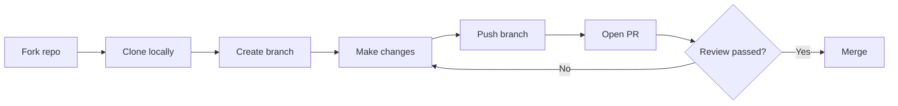
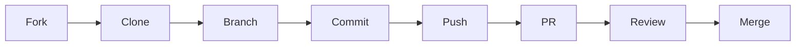
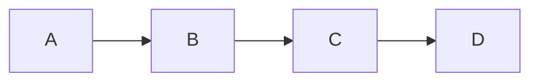
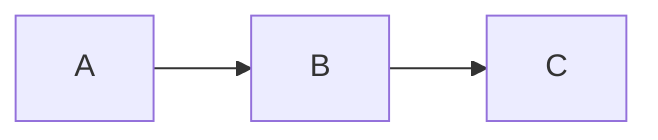

# Appendix E: Markdown and GitHub Flavored Markdown - Complete Guide
>
> **Listen to Episode 22:** [GitHub Flavored Markdown](../PODCASTS.md) - a conversational audio overview of this chapter. Listen before reading to preview the concepts, or after to reinforce what you learned.

## From First Paragraph to Polished Repository - Everything You Need to Know

> **Who this is for:** Everyone. Whether you have never written a single line of Markdown or you already know the basics and want to master the GitHub-specific extensions, this guide takes you from zero to confident. We start with what Markdown is and why it matters, walk through every foundational element with examples, and then cover the GitHub Flavored Markdown (GFM) features you will encounter in real repositories - alert blocks, Mermaid diagrams, math, footnotes, and more.
>
> **Why this matters for this workshop:** Every issue you file, every pull request you open, every README you read or write, every comment you post on GitHub uses Markdown. It is the language of collaboration on GitHub. Mastering it means your contributions look polished, your bug reports are clear, and your documentation is accessible to everyone - including screen reader users.
>
> **How to use this guide:** Read it straight through if you are new to Markdown. If you already know the basics, use the navigation below to jump to the topic you need. Every section includes the raw Markdown you type, what it looks like when rendered, and screen reader behavior notes so you know exactly what assistive technology users will experience.

---

## Table of Contents

### Part 1 - Markdown Foundations

1. [What Is Markdown?](#1-what-is-markdown)
2. [Where You Will Use Markdown in This Workshop](#2-where-you-will-use-markdown-in-this-workshop)
3. [How to Practice as You Read](#3-how-to-practice-as-you-read)
4. [Paragraphs and Line Breaks](#4-paragraphs-and-line-breaks)
5. [Headings](#5-headings)
6. [Emphasis - Bold, Italic, and Bold Italic](#6-emphasis---bold-italic-and-bold-italic)
7. [Strikethrough](#7-strikethrough)
8. [Lists - Ordered and Unordered](#8-lists---ordered-and-unordered)
9. [Nested Lists and Mixed Lists](#9-nested-lists-and-mixed-lists)
10. [Links](#10-links)
11. [Images](#11-images)
12. [Blockquotes](#12-blockquotes)
13. [Inline Code and Code Blocks](#13-inline-code-and-code-blocks)
14. [Horizontal Rules](#14-horizontal-rules)
15. [Escaping Special Characters](#15-escaping-special-characters)
16. [Tables](#16-tables)

### Part 2 - GitHub Flavored Markdown (GFM)

17. [What Is GitHub Flavored Markdown?](#17-what-is-github-flavored-markdown)
18. [Alert and Callout Blocks](#18-alert-and-callout-blocks)
19. [Collapsible Sections with Details and Summary](#19-collapsible-sections-with-details-and-summary)
20. [Task List Checkboxes](#20-task-list-checkboxes)
21. [Syntax Highlighting in Fenced Code Blocks](#21-syntax-highlighting-in-fenced-code-blocks)
22. [Mermaid Diagrams](#22-mermaid-diagrams)
23. [Math Expressions with LaTeX](#23-math-expressions-with-latex)
24. [Footnotes](#24-footnotes)
25. [Linked Heading Anchors and Tables of Contents](#25-linked-heading-anchors-and-tables-of-contents)
26. [Autolinked References - Issues, PRs, Commits, and Users](#26-autolinked-references---issues-prs-commits-and-users)
27. [HTML in Markdown](#27-html-in-markdown)

### Part 3 - Putting It All Together

28. [Screen Reader Behavior Summary](#28-screen-reader-behavior-summary)
29. [Accessible Markdown Authoring Checklist](#29-accessible-markdown-authoring-checklist)
30. [Common Mistakes and How to Fix Them](#30-common-mistakes-and-how-to-fix-them)
31. [Your First Real Markdown Document - Guided Exercise](#31-your-first-real-markdown-document---guided-exercise)
32. [Quick-Reference Card](#32-quick-reference-card)

---

## Part 1 - Markdown Foundations

---

## 1. What Is Markdown?

Markdown is a lightweight way to format plain text so it renders as rich, structured content - headings, bold text, links, lists, code blocks, tables, and more. You write in a plain text file using simple punctuation characters, and a Markdown processor converts those characters into formatted output.

Here is the key idea: **what you type is readable as plain text, and it is also readable as formatted content after rendering.** You never lose meaning either way. A screen reader can read your raw Markdown file and understand it. A sighted user can read the rendered version on GitHub and understand it. Both experiences work.

### A brief history

John Gruber created Markdown in 2004 with the goal of making a format that is "as easy to read and write as plain text." Since then, Markdown has become the default writing format for:

- GitHub (README files, issues, pull requests, comments, wikis, discussions)
- Stack Overflow and many developer forums
- Static site generators (Jekyll, Hugo, Gatsby)
- Note-taking apps (Obsidian, Notion, Bear)
- Documentation systems (MkDocs, Docusaurus, Read the Docs)
- Chat platforms (Slack, Discord, Microsoft Teams)

### Markdown versus HTML

Markdown converts to HTML behind the scenes. When you write `**bold**`, GitHub converts it to `<strong>bold</strong>`. When you write `# Heading`, it becomes `<h1>Heading</h1>`. You get the benefits of structured HTML without needing to write angle brackets.

The following table compares common formatting in HTML versus Markdown.

| What you want | HTML | Markdown |
|---|---|---|
| Bold text | `<strong>bold</strong>` | `**bold**` |
| Italic text | `<em>italic</em>` | `*italic*` |
| A link | `<a href="url">text</a>` | `[text](url)` |
| A heading | `<h2>Title</h2>` | `## Title` |
| A bullet list | `<ul><li>item</li></ul>` | `- item` |

Markdown is shorter, easier to type, and easier to read in its raw form. That is why it won.

### What gets rendered and what stays raw

When you view a `.md` file on GitHub, GitHub renders it automatically. You see the formatted output. When you edit that file, you see the raw Markdown. When a screen reader reads a rendered Markdown file on GitHub, it navigates the HTML that Markdown produced - headings, links, lists, and all their semantic structure.

---

## 2. Where You Will Use Markdown in This Workshop

Markdown is not just one tool in this workshop - it is the thread that connects everything you do. Here is every place you will write or read Markdown during the two days.

### Day 1 - GitHub Foundations (Browser)

The following table lists every Day 1 activity where Markdown is used.

| Activity | Where Markdown appears |
|---|---|
| Reading course materials | Every chapter and appendix is a `.md` file |
| Filing an issue (Chapter 4) | The issue body is Markdown - you format your bug report with headings, lists, and code blocks |
| Commenting on issues | Every comment is Markdown |
| Opening a pull request (Chapter 5) | The PR description is Markdown - you reference issues, add checklists, and explain your changes |
| Reviewing a pull request | Review comments are Markdown |
| Reading the README | The first file you see in any repository is `README.md` |

### Day 2 - VS Code and Accessibility Agents

The following table lists every Day 2 activity where Markdown is used.

| Activity | Where Markdown appears |
|---|---|
| Editing files in VS Code | You edit `.md` files directly with Markdown preview (`Ctrl+Shift+V`) |
| Writing commit messages | While not full Markdown, commit messages follow similar plain-text conventions |
| Using Copilot Chat (Chapter 13) | Copilot returns responses formatted in Markdown |
| Creating issue templates (Chapter 15) | Templates use Markdown for the body content |
| Agent commands and output (Chapter 16) | Agent reports are rendered Markdown |

### Learning Room connection

In the Learning Room repository, every challenge description, every welcome file, and every piece of documentation is Markdown. When you fix a broken link in `docs/welcome.md` for Challenge 1, you are editing Markdown. When you add alt text to an image for an accessibility challenge, you are writing Markdown. The skill you build in this appendix is the skill you use in every challenge.

---

## 3. How to Practice as You Read

The best way to learn Markdown is to type it yourself. Here are three ways to practice as you read this guide.

### Option 1 - GitHub Issue (recommended for Day 1)

1. Go to any repository where you have write access (the Learning Room works)
2. Click **New Issue**
3. Type Markdown in the issue body
4. Click the **Preview** tab to see the rendered result
5. Switch back to **Write** to keep editing
6. You do not need to submit the issue - the Preview tab is your sandbox

> **Screen reader note:** The Write and Preview tabs are announced as tab buttons. Press `Enter` on "Preview" to switch. NVDA announces the rendered content normally. Press `Enter` on "Write" to return to the edit field.

### Option 2 - Any `.md` file in VS Code (recommended for Day 2)

1. Create a new file: `Ctrl+N`, then save it as `practice.md`
2. Type your Markdown in the editor
3. Press `Ctrl+Shift+V` to open the rendered Markdown preview in a new tab
4. The preview updates live as you type

### Option 3 - GitHub Gist

1. Go to [gist.github.com](https://gist.github.com)
2. Name your file `practice.md`
3. Type Markdown in the content area
4. Click **Create secret gist** (only you can see it)
5. View the rendered result

---

## 4. Paragraphs and Line Breaks

This is the most fundamental element in Markdown, and it trips up almost everyone at first.

### Paragraphs

A paragraph is one or more lines of text separated by a **blank line** (an empty line with nothing on it). If you do not leave a blank line between two blocks of text, Markdown treats them as one continuous paragraph.

**What you type:**

```markdown
This is the first paragraph. It contains a complete thought
and continues on the next line without a break.

This is the second paragraph. The blank line above tells
Markdown to start a new paragraph.
```

**What renders:**

This is the first paragraph. It contains a complete thought and continues on the next line without a break.

This is the second paragraph. The blank line above tells Markdown to start a new paragraph.

### Line breaks within a paragraph

Sometimes you want to go to a new line without starting a whole new paragraph - for example, in an address or a poem. To create a line break (a `<br>` in HTML), end a line with **two or more spaces** and then press Enter. Alternatively, you can use a backslash (`\`) at the end of the line, or use an explicit `<br>` HTML tag.

**What you type:**

```markdown
123 Main Street  
Springfield, IL 62701  
United States
```

(There are two spaces after "Street" and after "62701" - you cannot see them, but they are there.)

**What renders:**

123 Main Street
Springfield, IL 62701
United States

> **Screen reader note:** Paragraphs are announced as separate blocks of text. Line breaks within a paragraph are read as continuous text with a brief pause. Screen readers do not announce "new paragraph" for a `<br>` - they just pause slightly.

> **Tip:** The two-trailing-spaces method is invisible and easy to lose when editing. Many authors prefer the explicit `<br>` tag instead, because it is visible in the source:

```markdown
123 Main Street<br>
Springfield, IL 62701<br>
United States
```

### Common mistake - no blank line between paragraphs

**What you type (wrong):**

```markdown
First paragraph.
Second paragraph.
```

**What renders (wrong):** Both lines merge into one paragraph:

First paragraph. Second paragraph.

**Fix:** Add a blank line between them.

---

## 5. Headings

Headings create the structure of your document. They are how screen readers navigate, how tables of contents are built, and how readers scan for the section they need.

### Syntax

Add one to six `#` characters at the start of a line, followed by a space, then the heading text. The number of `#` characters determines the heading level.

**What you type:**

```markdown
# Heading Level 1
## Heading Level 2
### Heading Level 3
#### Heading Level 4
##### Heading Level 5
###### Heading Level 6
```

**What these produce in HTML:**

| Markdown | HTML | Typical use |
|---|---|---|
| `# Title` | `<h1>` | Document title - one per document |
| `## Section` | `<h2>` | Major sections |
| `### Subsection` | `<h3>` | Subsections within a section |
| `#### Detail` | `<h4>` | Detailed topics within a subsection |
| `##### Fine detail` | `<h5>` | Rarely used, very specific topics |
| `###### Finest detail` | `<h6>` | Almost never needed |

### Rules for accessible headings

1. **One H1 per document.** The `#` heading is your document title. Every document gets exactly one
2. **Never skip levels.** Go from `##` to `###`, never from `##` to `####`. Skipping levels breaks the document outline for screen reader users who navigate by heading
3. **Make headings descriptive.** A heading of "Section 3" tells a screen reader user nothing. A heading of "Creating Your First Pull Request" tells them exactly what the section covers
4. **Do not use bold as a heading substitute.** Writing `**My Section**` on its own line looks like a heading visually, but it is not a heading in the document structure. Screen reader users navigating by heading (`H` key in Browse Mode) will never find it

> **Screen reader note:** Screen readers let you navigate by heading level. In NVDA and JAWS, pressing `H` moves to the next heading. Pressing `1` through `6` moves to the next heading at that specific level. This is one of the most important navigation methods on any page - and it only works if the document uses real headings in the correct hierarchy.

### Alternative heading syntax (not recommended)

Markdown also supports "setext" headings where you underline text with `=` or `-` characters:

```markdown
Heading Level 1
===============

Heading Level 2
---------------
```

This only works for levels 1 and 2, and it is harder to scan visually in raw Markdown. Stick with the `#` syntax - it is clearer, supports all six levels, and is what you will see in virtually every GitHub project.

---

## 6. Emphasis - Bold, Italic, and Bold Italic

Emphasis changes how text is read by screen readers - it is not just visual. When text is bold or italic, well-configured screen readers can announce emphasis changes, giving the listener additional context about importance.

### Bold

Wrap text in **two asterisks** or **two underscores** on each side.

**What you type:**

```markdown
This is **bold text** using asterisks.
This is __bold text__ using underscores.
```

**What renders:**

This is **bold text** using asterisks.
This is __bold text__ using underscores.

**Best practice:** Use asterisks (`**`). Underscores can cause problems in the middle of words (like `file__name__here`), while asterisks always work.

### Italic

Wrap text in **one asterisk** or **one underscore** on each side.

**What you type:**

```markdown
This is *italic text* using asterisks.
This is _italic text_ using underscores.
```

**What renders:**

This is *italic text* using asterisks.
This is _italic text_ using underscores.

### Bold and italic combined

Wrap text in **three asterisks** on each side.

**What you type:**

```markdown
This is ***bold and italic*** text.
```

**What renders:**

This is ***bold and italic*** text.

### When to use emphasis

The following table provides guidance on when to use each type of emphasis.

| Type | When to use | Example |
|---|---|---|
| **Bold** | Key terms, important warnings, UI element names | "Click the **Submit** button" |
| *Italic* | Book or document titles, introducing new terms, gentle emphasis | "See the *Contributing Guide* for details" |
| ***Bold italic*** | Extremely rare - critical warnings only | "***Do not force push to the main branch***" |

> **Screen reader note:** NVDA can announce emphasis changes if the user enables "Report font attributes" (under Speech settings). JAWS can announce emphasis with "Say all font changes" enabled. VoiceOver announces emphasis by default on macOS. Even when emphasis is not announced, the HTML semantic structure (`<strong>` for bold, `<em>` for italic) is available to screen readers that choose to report it.

### Emphasis inside words

Asterisks work inside words. Underscores do not (in most Markdown processors including GitHub).

```markdown
This**works**fine.
This__does__not.
```

Renders as: This**works**fine. This__does__not.

Use asterisks when you need emphasis inside a word (rare, but it comes up in technical documentation).

---

## 7. Strikethrough

Strikethrough text shows deleted or outdated content with a line through it. Wrap text in **two tildes** on each side.

**What you type:**

```markdown
The meeting is ~~Tuesday~~ Wednesday at 3 PM.
~~This feature has been removed.~~
```

**What renders:**

The meeting is ~~Tuesday~~ Wednesday at 3 PM.
~~This feature has been removed.~~

> **Screen reader note:** Screen reader behavior with strikethrough varies. NVDA with "Report font attributes" enabled will announce "strikethrough" before the text. JAWS may announce it as "deleted." VoiceOver does not announce strikethrough by default - the text is simply read. Because of this inconsistency, do not rely on strikethrough alone to convey meaning. Add context in the surrounding text: "The meeting was changed from ~~Tuesday~~ to Wednesday."

> **GitHub note:** Strikethrough is part of the GitHub Flavored Markdown specification. It is not in standard Markdown or CommonMark.

---

## 8. Lists - Ordered and Unordered

Lists are one of the most common elements in GitHub documentation. Issue descriptions, PR checklists, README instructions, step-by-step guides - they all use lists.

### Unordered lists (bullet points)

Start each line with a dash (`-`), asterisk (`*`), or plus sign (`+`) followed by a space.

**What you type:**

```markdown
- First item
- Second item
- Third item
```

**What renders:**

- First item
- Second item
- Third item

**Best practice:** Use dashes (`-`). They are the most common convention on GitHub and visually distinct from the asterisks used for bold and italic.

> **Important:** Be consistent within a single list. Do not mix `-`, `*`, and `+` in the same list - some processors handle it inconsistently, and it makes the raw Markdown harder to read.

### Ordered lists (numbered)

Start each line with a number followed by a period and a space.

**What you type:**

```markdown
1. Clone the repository
2. Create a new branch
3. Make your changes
4. Open a pull request
```

**What renders:**

1. Clone the repository
2. Create a new branch
3. Make your changes
4. Open a pull request

### A helpful trick - Markdown renumbers for you

Here is something that surprises most new users. In Markdown, the actual numbers you type do not matter for the rendered output. Markdown automatically numbers the list sequentially. This means you can use `1.` for every item:

```markdown
1. Clone the repository
1. Create a new branch
1. Make your changes
1. Open a pull request
```

This still renders as 1, 2, 3, 4. The benefit is that when you insert a new step in the middle, you do not need to renumber everything. However, for readability of the raw Markdown, many authors prefer typing the correct numbers.

> **Screen reader note:** Screen readers announce list items with their position: "list, 4 items. 1. Clone the repository. 2. Create a new branch." and so on. The semantic list structure is preserved in the HTML output, so navigation commands like `L` (next list) and `I` (next list item) work correctly in NVDA and JAWS Browse Mode.

### Starting an ordered list at a specific number

If you need a list to start at a number other than 1, use that number for the first item. All subsequent items are numbered sequentially from there:

```markdown
3. This is step three
4. This is step four
5. This is step five
```

---

## 9. Nested Lists and Mixed Lists

Lists can contain other lists, creating an indented hierarchy. This is essential for complex instructions, outlines, and project structures.

### Nesting unordered lists

Indent the nested items by **two or four spaces** (GitHub accepts either, but four is most reliable).

**What you type:**

```markdown
- Accessibility testing tools
    - Screen readers
        - NVDA (Windows, free)
        - JAWS (Windows, commercial)
        - VoiceOver (macOS and iOS, built-in)
    - Browser extensions
        - axe DevTools
        - WAVE
- Documentation tools
    - Markdown editors
    - Static site generators
```

**What renders:**

- Accessibility testing tools
    - Screen readers
        - NVDA (Windows, free)
        - JAWS (Windows, commercial)
        - VoiceOver (macOS and iOS, built-in)
    - Browser extensions
        - axe DevTools
        - WAVE
- Documentation tools
    - Markdown editors
    - Static site generators

### Nesting ordered lists

The same indentation principle applies to numbered lists:

```markdown
1. Set up your environment
    1. Install Git
    2. Create a GitHub account
    3. Configure your screen reader
2. Learn GitHub navigation
    1. Understand the page structure
    2. Master keyboard shortcuts
    3. Practice with the Learning Room
```

### Mixing ordered and unordered lists

You can nest an unordered list inside an ordered list and vice versa:

```markdown
1. Before the workshop
    - Create a GitHub account
    - Install VS Code
    - Test your screen reader
2. During Day 1
    - File your first issue
    - Open your first pull request
3. After the workshop
    - Continue contributing
    - Join community discussions
```

### Adding content inside list items

List items can contain paragraphs, code blocks, and other elements. Indent the content to align with the list item text (typically four spaces):

```markdown
1. Clone the repository

    Open your terminal and run the following command:

    ```bash
    git clone https://github.com/community-access/accessibility-agents.git
    ```

    This downloads the entire repository to your computer.

2. Create a new branch

    ```bash
    git checkout -b fix/broken-link
    ```
```

> **Screen reader note:** Nested lists are announced with their nesting level. NVDA says "list, nesting level 2" when entering an inner list. This helps you understand the hierarchy by ear.

---

## 10. Links

Links are how you connect documents, reference issues, point to external resources, and cite sources. Getting links right is critical for accessibility - links with bad text are one of the most common accessibility failures in documentation.

### Basic link syntax

Wrap the visible link text in square brackets, followed immediately by the URL in parentheses:

```markdown
[GitHub Documentation](https://docs.github.com)
```

**Renders as:** [GitHub Documentation](https://docs.github.com)

### Links with title text

Add a title in quotes after the URL. The title appears as a tooltip on hover:

```markdown
[GitHub Documentation](https://docs.github.com "Official GitHub docs and guides")
```

> **Screen reader note:** Link titles are not reliably announced by all screen readers. Do not put critical information only in the title text. The link text itself must be descriptive.

### Writing accessible link text

This is one of the most important accessibility skills in Markdown authoring. Screen reader users often navigate by pulling up a list of all links on a page (NVDA: `NVDA+F7` then select Links; JAWS: `Insert+F7`). In this list, only the link text is shown - not the surrounding sentence. Every link must make sense on its own.

The following table contrasts bad and good link text with an explanation.

| Bad (do not do this) | Good (do this instead) | Why |
|---|---|---|
| Click [here](url) for the guide | Read the [Contributing Guide](url) | "here" means nothing out of context |
| [Read more](url) | [Read the full accessibility audit report](url) | "Read more" is ambiguous in a link list |
| [https://docs.github.com](https://docs.github.com) | [GitHub Documentation](https://docs.github.com) | Screen readers read the entire URL character by character |
| [Link](url) | [Pre-Workshop Setup instructions](url) | "Link" tells you nothing about the destination |

### Reference-style links

For documents with many links, reference-style links keep the text readable by separating the URL from the prose. You define the link target once at the bottom of the document:

```markdown
Check the [Contributing Guide][contributing] before submitting a PR.
See also the [Code of Conduct][coc] for community standards.

[contributing]: https://github.com/community-access/accessibility-agents/blob/main/CONTRIBUTING.md
[coc]: https://github.com/community-access/accessibility-agents/blob/main/CODE_OF_CONDUCT.md
```

The reference labels (`[contributing]`, `[coc]`) do not appear in the rendered output. Readers just see clean, clickable links.

### Relative links within a repository

When linking to other files in the same repository, use relative paths instead of full URLs. This way, links work on any fork or branch:

```markdown
See the [Pre-Workshop Setup](00-pre-workshop-setup.md) guide.
Jump to the [Glossary](appendix-a-glossary.md#fork) entry for "fork."
Return to the [course guide](course-guide.md).
```

### Email links

```markdown
Contact us at <support@example.com>
```

The angle brackets tell Markdown to create a `mailto:` link: <support@example.com>

### Autolinked URLs

GitHub automatically converts full URLs in your text into clickable links, but always prefer explicit descriptive links in prose. Bare URLs should only appear in reference sections or code examples.

---

## 11. Images

Images in Markdown use a syntax similar to links, with an exclamation mark (`!`) at the beginning.

### Syntax

```markdown

```

The text inside the square brackets is the **alt text** - the description that screen readers read aloud instead of displaying the image. This is the single most important accessibility attribute for images.

### Writing good alt text

The following table provides guidance on alt text for different types of images.

| Image type | Good alt text | Bad alt text |
|---|---|---|
| Screenshot of a form | "GitHub new issue form with title field, body text area, and submit button" | "screenshot" |
| Logo | "Community Access logo" | "logo.png" |
| Decorative divider | Leave alt text empty: `` | "divider" |
| Chart or graph | "Bar chart showing screen reader usage: JAWS 40%, NVDA 35%, VoiceOver 15%, Other 10%" | "chart" |
| Photo of a person | "Jamie presenting at the accessibility workshop podium" | "photo" |

### Image with a link

To make an image clickable, wrap the image syntax inside a link:

```markdown
[](https://community-access.org)
```

### Image with a title

```markdown

```

### When to use details blocks for complex images

If an image contains complex information (like an architecture diagram or a data visualization), provide a full text description in a collapsible `<details>` block:

```markdown


<details>
<summary>Full description of the architecture diagram</summary>

The architecture has three tiers:

1. The GitHub Hub agent receives all user requests
2. The Hub routes to specialist agents (issue-tracker, pr-review, analytics)
3. Each specialist agent returns structured markdown reports

</details>
```

> **Screen reader note:** Screen readers announce images as "graphic" followed by the alt text. If alt text is empty, the image is treated as decorative and skipped. If alt text is missing entirely (no square brackets), some screen readers will announce the filename, which is not helpful. Always include the square brackets, even if empty for decorative images.

---

## 12. Blockquotes

Blockquotes are used for callouts, important notes, cited text, and instructor guidance throughout this course. Start each line with a `>` character followed by a space.

### Basic blockquote

**What you type:**

```markdown
> This is a blockquote. It is used to highlight important information
> or to quote someone else's text.
```

**What renders:**

> This is a blockquote. It is used to highlight important information or to quote someone else's text.

### Multi-paragraph blockquotes

Add a `>` on the blank lines between paragraphs to keep them inside the blockquote:

```markdown
> This is the first paragraph of the blockquote.
>
> This is the second paragraph. The blank line with just ">" keeps
> both paragraphs inside the same blockquote.
```

### Nested blockquotes

```markdown
> This is the outer blockquote.
>
> > This is a nested blockquote inside the first one.
>
> Back to the outer level.
```

### Blockquotes with other elements

Blockquotes can contain any Markdown element - headings, lists, code, bold, links:

```markdown
> **Important:** Before starting the exercise:
>
> 1. Make sure you are on the `main` branch
> 2. Pull the latest changes: `git pull origin main`
> 3. Read the [challenge description](challenges.md) first
>
> If you get stuck, ask in the issue thread.
```

> **Screen reader note:** Screen readers announce the beginning and end of a blockquote. NVDA says "block quote" when entering and "out of block quote" when leaving. Content inside is read normally. This means blockquotes are an excellent way to highlight important information for all users.

### How we use blockquotes in this course

Throughout this workshop, blockquotes serve specific purposes:

- **Screen reader notes:** Tips specific to assistive technology users
- **Learning Room connections:** How the current topic connects to the practice repo
- **Important warnings:** Critical information that could prevent errors
- **Instructor guidance:** Notes from the facilitator about pacing or approach

---

## 13. Inline Code and Code Blocks

Code formatting is essential on GitHub. You will use it for command-line instructions, file names, configuration values, keyboard shortcuts, and actual source code.

### Inline code

Wrap text in single backticks (`` ` ``) to format it as code within a sentence.

**What you type:**

```markdown
Run `git status` to see which files have changed.
The configuration file is `package.json`.
Press `Ctrl+Shift+P` to open the Command Palette.
```

**What renders:**

Run `git status` to see which files have changed.
The configuration file is `package.json`.
Press `Ctrl+Shift+P` to open the Command Palette.

**When to use inline code:**

- Command names: `git clone`, `npm install`
- File names: `README.md`, `CONTRIBUTING.md`
- Keyboard shortcuts: `Ctrl+C`, `Alt+Tab`
- Variable or function names: `userName`, `getElementById()`
- Configuration values: `true`, `false`, `null`
- Branch names: `main`, `feature/add-alt-text`

### Code blocks (fenced)

For multi-line code, wrap it in triple backticks (` ``` `) on their own lines:

**What you type:**

````markdown
```
This is a code block.
All formatting is preserved exactly.
    Indentation stays.
**Bold does not render** - it stays as plain text.
```
````

### Code blocks with syntax highlighting

Add a language identifier right after the opening triple backticks to enable syntax highlighting:

````markdown
```python
def greet(name: str) -> str:
    """Return a greeting for the given name."""
    return f"Hello, {name}! Welcome to the workshop."
```
````

```python
def greet(name: str) -> str:
    """Return a greeting for the given name."""
    return f"Hello, {name}! Welcome to the workshop."
```

The following table lists language identifiers you will encounter most often in this workshop.

| Language | Identifier | Used for |
|---|---|---|
| Python | `python` | Scripts, automation, Copilot examples |
| Bash / Shell | `bash` or `shell` | Terminal commands, Git operations |
| YAML | `yaml` | GitHub Actions workflows, issue templates |
| JSON | `json` | Configuration files, API responses |
| JavaScript | `javascript` or `js` | Web scripts, Node.js |
| HTML | `html` | Web page structure |
| CSS | `css` | Styling |
| Markdown | `markdown` | Markdown examples (yes, you can format Markdown inside Markdown) |
| Plain text | `text` or `plaintext` | When no highlighting is needed |
| Diff | `diff` | Showing code changes (additions in green, removals in red) |

### Showing diffs in code blocks

The `diff` language identifier highlights additions and removals:

````markdown
```diff
- old line that was removed
+ new line that was added
  unchanged context line
```
````

```diff
- old line that was removed
+ new line that was added
  unchanged context line
```

### Code blocks inside list items

Indent the code block to align with the list item text:

```markdown
1. Create a new branch:

    ```bash
    git checkout -b feature/my-change
    ```

2. Make your changes and stage them:

    ```bash
    git add .
    ```
```

### How to show literal backticks

If your code contains backticks, use more backticks for the fence:

`````markdown
````markdown
```python
print("Hello")
```
````
`````

Use four backticks to wrap content that contains triple backticks. Use five to wrap content that contains four. You get the idea.

> **Screen reader note:** Code blocks are announced as "code" regions. Screen readers read the content character by character when navigating with arrow keys, and as whole lines when navigating with `Down Arrow`. Syntax highlighting is visual only - it does not affect what screen readers announce. The code text is equally accessible whether highlighted or not.

---

## 14. Horizontal Rules

A horizontal rule creates a thematic break between sections - a visual line across the page. Use three or more dashes, asterisks, or underscores on a line by themselves.

**What you type (any of these work):**

```markdown
---

***

___
```

**Best practice:** Use `---` (three dashes). It is the most common convention and looks clean in raw Markdown. Always put a blank line before and after the rule.

> **Screen reader note:** Horizontal rules are announced as "separator" in NVDA, "horizontal separator" in JAWS, and "horizontal rule" in VoiceOver. They are useful as navigation landmarks - screen reader users can move between them, but do not overuse them. Headings are a better way to structure a document.

---

## 15. Escaping Special Characters

Many characters have special meaning in Markdown. If you want to display them as literal characters instead, put a backslash (`\`) before them.

### Characters that can be escaped

The following table lists every character that can be escaped in Markdown.

| Character | Name | Markdown meaning |
|---|---|---|
| `\` | Backslash | Escape character itself |
| `` ` `` | Backtick | Inline code |
| `*` | Asterisk | Bold, italic, or list item |
| `_` | Underscore | Bold or italic |
| `{}` | Curly braces | Used in some extensions |
| `[]` | Square brackets | Link text |
| `()` | Parentheses | Link URL |
| `#` | Hash | Heading |
| `+` | Plus sign | Unordered list |
| `-` | Dash | Unordered list or horizontal rule |
| `.` | Period | Ordered list (after a number) |
| `!` | Exclamation mark | Image |
| `|` | Pipe | Table column separator |
| `~` | Tilde | Strikethrough |

### Examples

**What you type:**

```markdown
This asterisk is literal: \*not bold\*
This hash is literal: \# not a heading
Show a pipe character: \|
```

**What renders:**

This asterisk is literal: \*not bold\*
This hash is literal: \# not a heading
Show a pipe character: \|

---

## 16. Tables

Tables organize data into rows and columns. They are used extensively on GitHub for comparison charts, reference data, settings documentation, and checklists.

### Basic table syntax

```markdown
| Name | Role | Platform |
|---|---|---|
| NVDA | Screen reader | Windows |
| JAWS | Screen reader | Windows |
| VoiceOver | Screen reader | macOS / iOS |
| TalkBack | Screen reader | Android |
```

**What renders:**

| Name | Role | Platform |
|---|---|---|
| NVDA | Screen reader | Windows |
| JAWS | Screen reader | Windows |
| VoiceOver | Screen reader | macOS / iOS |
| TalkBack | Screen reader | Android |

### How table syntax works

- The **first row** is always the header row
- The **second row** contains dashes (`---`) that separate the header from the data. You need at least three dashes per column
- Each **subsequent row** is a data row
- Columns are separated by pipe characters (`|`)
- Leading and trailing pipes are optional but recommended for readability

### Column alignment

Add colons (`:`) to the separator row to control text alignment:

```markdown
| Left aligned | Center aligned | Right aligned |
|:---|:---:|---:|
| Text | Text | Text |
| Longer text here | Centered text | 42 |
```

| Left aligned | Center aligned | Right aligned |
|:---|:---:|---:|
| Text | Text | Text |
| Longer text here | Centered text | 42 |

- `:---` = left aligned (default)
- `:---:` = center aligned
- `---:` = right aligned

### Formatting inside table cells

You can use inline formatting within table cells:

```markdown
| Feature | Status | Notes |
|---|---|---|
| **Bold text** | `code` | Works [with links](url) too |
| *Italic text* | ~~struck~~ | Use any inline formatting |
```

### Accessibility considerations for tables

1. **Always include a description before the table.** Add a one-sentence summary immediately above the table explaining what it contains. Screen reader users hear the table structure (rows and columns) but benefit from knowing what the table is about before entering it
2. **Keep tables simple.** Tables with more than 5-6 columns become difficult to navigate with a screen reader. Consider splitting wide tables into multiple narrower tables
3. **Use tables for data, not layout.** If you are using a table just to arrange content side by side, use a list instead
4. **Make the header row descriptive.** The header cell is announced before each data cell when navigating by column, so "Platform" is better than "Col 3"

> **Screen reader note:** Screen readers navigate tables with `Ctrl+Alt+Arrow` keys (NVDA and JAWS). `Ctrl+Alt+Right` moves to the next column. `Ctrl+Alt+Down` moves to the next row. The column header is announced each time you move to a new column. Table mode is entered automatically when the screen reader encounters a table.

### When not to use a table

If your "table" has only two columns where the first is a label and the second is a value, consider using a definition-style list or bold labels instead:

```markdown
**Name:** Community Access
**Founded:** 2020
**Mission:** Empowering blind and low vision technology professionals
```

This is often easier to read with a screen reader than a two-column table.

---

## Part 2 - GitHub Flavored Markdown (GFM)

---

## 17. What Is GitHub Flavored Markdown?

GitHub Flavored Markdown (GFM) is GitHub's own superset of standard Markdown. It takes everything from the CommonMark specification (the modern standard for Markdown) and adds features specifically designed for software collaboration: tables, task lists, strikethrough, autolinked references, alert blocks, Mermaid diagrams, math expressions, and footnotes.

Everything you learned in Part 1 works everywhere Markdown is supported. Everything in Part 2 is specific to GitHub (and some other platforms that have adopted GFM).

### Where GFM works

The following table shows where GFM is supported.

| Location | GFM supported | Notes |
|---|---|---|
| `.md` files in repos | Yes | Any Markdown file rendered on GitHub |
| Issue descriptions | Yes | Full GFM with autolinks |
| Issue comments | Yes | Full GFM with autolinks |
| Pull request descriptions | Yes | Full GFM with autolinks |
| Pull request comments | Yes | Full GFM with autolinks |
| Discussion posts | Yes | Full GFM with autolinks |
| Wiki pages | Yes | Full GFM |
| Gists | Yes | Full GFM |
| Commit messages | Partial | Basic formatting, autolinks - no Mermaid or math |
| GitHub Pages (Jekyll) | Depends | Jekyll has its own Markdown processor |
| VS Code preview | Mostly | Supports most GFM; Mermaid requires an extension |

---

## 18. Alert and Callout Blocks

GitHub introduced **alert blocks** in 2023. They render as colored, bordered callout boxes - great for emphasizing warnings, tips, or critical information. You will see these throughout this course to highlight screen reader notes, important warnings, and tips.

### Syntax

```markdown
> [!NOTE]
> Useful information that users should know, even when skimming.

> [!TIP]
> Helpful advice for doing something better or more easily.

> [!IMPORTANT]
> Key information users need to know to achieve their goal.

> [!WARNING]
> Urgent info that needs immediate attention to avoid problems.

> [!CAUTION]
> Advises about risks or negative outcomes of certain actions.
```

### How to write them

1. Start a blockquote with `>`
2. The first line must be exactly `> [!TYPE]` where TYPE is one of: `NOTE`, `TIP`, `IMPORTANT`, `WARNING`, `CAUTION`
3. All subsequent lines start with `>` and a space, just like a regular blockquote
4. You can include any Markdown inside the alert: lists, code, links, bold

### Choosing the right alert type

The following table describes each alert type and when to use it.

| Type | Color | When to use | Example |
|---|---|---|---|
| `NOTE` | Blue | Supplementary information the reader should know | Additional context about a feature |
| `TIP` | Green | Best practice or shortcut | "Use `Ctrl+Shift+P` for faster access" |
| `IMPORTANT` | Purple | Something the reader absolutely must know | Required configuration step |
| `WARNING` | Yellow | A potential problem or non-obvious risk | "This changes are not reversible after merge" |
| `CAUTION` | Red | An action that could cause irreversible harm | "This deletes all branches and cannot be undone" |

### Multi-line alert with formatting

```markdown
> [!WARNING]
> **Do not skip the pre-workshop setup.**
>
> If you arrive without a configured environment, you will spend the first
> hour catching up while others are working on challenges. Complete
> [Chapter 0](00-pre-workshop-setup.md) before Day 1.
>
> Checklist:
>
> - Git installed
> - GitHub account created
> - Screen reader configured for GitHub
```

### Screen Reader Behavior

Alert blocks render as `<blockquote>` elements with an SVG icon and a strong heading. Screen readers read:

- NVDA/JAWS: announces `blockquote` role, then reads the type label ("Note", "Warning") then the content
- VoiceOver: reads the type as bold text then the content
- The colored icon is decorative (`aria-hidden`); it does not add information beyond the type label

---

## 19. Collapsible Sections with Details and Summary

The `<details>` and `<summary>` HTML elements create collapsible sections. They are one of the most useful tools for keeping long documents, issue reports, and PRs manageable - hiding optional content until the reader chooses to expand it.

### Basic syntax

```markdown
<details>
<summary>Click to expand: Full error log</summary>

Content that is hidden until the user expands this section.

You can put **any Markdown** in here:

- Lists
- Code blocks
- Links
- Tables

</details>
```

### Important formatting rules

1. **Blank line after `<summary>`.** Put a blank line between the closing `</summary>` tag and your Markdown content. Without it, Markdown formatting inside may not render
2. **Blank line before `</details>`.** Same principle at the end
3. The `<summary>` text should be descriptive - it is the only thing visible when collapsed

### Real-world uses in this workshop

The following list describes common uses for collapsible sections.

- **Bug reports in issues:** Collapse the full stack trace so the issue body stays readable
- **Long configuration blocks:** Let readers expand the full YAML only if they need it
- **Exercise solutions:** Collapse the answer so learners try the exercise first
- **Screen reader guidance blocks:** Throughout this course, some sections collapse detailed assistive technology instructions so sighted users see a cleaner page while screen reader users can easily expand them
- **Meeting notes:** Collapse detailed minutes while showing the summary

### Nesting details inside details

```markdown
<details>
<summary>Operating system instructions</summary>

<details>
<summary>Windows</summary>

1. Open PowerShell
2. Run `git --version`

</details>

<details>
<summary>macOS</summary>

1. Open Terminal
2. Run `git --version`

</details>

</details>
```

### Details sections that start open

Add the `open` attribute to have the section expanded by default:

```markdown
<details open>
<summary>Currently known issues</summary>

- Checkbox toggle requires Focus Mode in NVDA
- Alert blocks do not render in email notifications

</details>
```

### Screen Reader Behavior

The `<details>` element renders as a disclosure widget:

- NVDA: announces "button collapsed" for the `<summary>` - press `Enter` or `Space` to expand
- JAWS: announces "collapsed" - press `Enter` on the summary to expand
- VoiceOver: announces "collapsed, button" - press `VO+Space` to activate

**After expanding:** The content is immediately readable. Screen readers announce "button expanded" for the summary. No page reload occurs.

---

## 20. Task List Checkboxes

Task lists in GitHub issues and PRs render as **real interactive checkboxes**. Anyone with write access to the repository can check and uncheck them directly in the rendered view without editing the Markdown.

### Syntax

```markdown
- [x] Color contrast verified (4.5:1 minimum for body text)
- [x] Keyboard navigation tested
- [ ] Screen reader tested with NVDA
- [ ] Screen reader tested with JAWS
- [ ] Screen reader tested with VoiceOver
- [ ] Alt text provided for all images
- [ ] Focus indicators visible
```

### How to write them

1. Start with a list item marker (`-`, `*`, or `+`) and a space
2. Add `[x]` for a checked box or `[ ]` (with a space inside) for an unchecked box
3. Add a space, then the task description
4. The description should be meaningful - "Test NVDA" is better than "Item 3"

### What makes task lists special on GitHub

- **Progress tracking:** In issues, GitHub shows a progress bar: "2 of 7 tasks completed"
- **Click to check:** In the rendered view, users with triage or write permissions can click to toggle checkboxes without editing the comment
- **Linked issues:** You can reference issues in a task: `- [ ] Fix #42` - the task shows the issue title and its open/closed state
- **PR templates:** Task lists in PR templates create checklists that authors fill out before requesting review

### Example - pull request checklist

```markdown
## Pre-review checklist

- [x] Changes are limited to the files listed in the issue
- [x] All new images have descriptive alt text
- [ ] Screen reader tested the changes with NVDA
- [ ] No heading levels are skipped
- [ ] All links use descriptive text (not "click here")
```

### Screen Reader Interaction

In Browse Mode, checkboxes are read as `checkbox, not checked` or `checkbox, checked`.

**To toggle a task list checkbox:**

- NVDA: Press `NVDA+Space` to enter Focus Mode, then `Tab` to find the checkbox, then `Space` to toggle it
- JAWS: `Tab` to the checkbox, then `Space` to toggle
- VoiceOver: `VO+Space` on the checkbox element

---

## 21. Syntax Highlighting in Fenced Code Blocks

We covered basic code blocks in Section 13. This section covers the GitHub-specific syntax highlighting that makes code blocks more readable for sighted users.

### How it works

Add a language identifier right after the opening triple backticks. GitHub uses Linguist to apply syntax highlighting with appropriate colors for keywords, strings, comments, and other language constructs.

````markdown
```python
def check_accessibility(element):
    """Check if an element has proper ARIA attributes."""
    if not element.get("aria-label") and not element.get("aria-labelledby"):
        return "Missing accessible name"
    return "Accessible"
```
````

### Complete list of commonly used language identifiers

The following table lists the language identifiers you are most likely to use.

| Identifier | Language | Example use in this workshop |
|---|---|---|
| `python` | Python | Scripts, automation, challenge code |
| `bash` or `shell` | Bash/Shell | Terminal commands, Git operations |
| `yaml` or `yml` | YAML | GitHub Actions, issue templates |
| `json` | JSON | Configuration, API responses |
| `javascript` or `js` | JavaScript | Web scripts |
| `typescript` or `ts` | TypeScript | Typed JavaScript |
| `html` | HTML | Web page structure |
| `css` | CSS | Styling |
| `markdown` or `md` | Markdown | Documenting Markdown syntax |
| `diff` | Diff | Code change comparison |
| `text` or `plaintext` | None | No highlighting needed |
| `ruby` | Ruby | Ruby scripts |
| `go` | Go | Go programs |
| `rust` | Rust | Rust programs |
| `java` | Java | Java programs |
| `csharp` or `cs` | C# | .NET programs |
| `sql` | SQL | Database queries |
| `dockerfile` | Dockerfile | Container configuration |
| `xml` | XML | Structured data |
| `toml` | TOML | Configuration (Rust, Python) |
| `ini` | INI | Configuration files |
| `powershell` or `ps1` | PowerShell | Windows automation |

If no language is specified, the code block renders as plain monospaced text with no highlighting.

### Screen Reader Note

Syntax highlighting is visual only - screen readers read the code text without announcing color changes. The code block itself is announced as a `code` region. This means the text content of well-written code is equally accessible whether highlighted or not. Variable names, function names, and comments are the real accessibility of code - not colors.

---

## 22. Mermaid Diagrams

GitHub renders [Mermaid.js](https://mermaid.js.org/) diagrams inline when you use a `mermaid` fenced code block. They are common in READMEs, PRs, and documentation to illustrate architecture, flows, and relationships.

### Syntax

````markdown

````

### Common diagram types

The following table lists the Mermaid diagram types you are most likely to encounter on GitHub.

| Type | Keyword | Use case |
|---|---|---|
| Flowchart | `flowchart LR` or `flowchart TD` | Process flows, decision trees |
| Sequence diagram | `sequenceDiagram` | API calls, user interactions |
| Entity-Relationship | `erDiagram` | Database schemas |
| Class diagram | `classDiagram` | Code architecture |
| Gantt chart | `gantt` | Project schedules |
| Git graph | `gitGraph` | Branch and merge visualization |
| Pie chart | `pie` | Data distribution |

### Accessibility limitation - critical

> **Important:** Mermaid diagrams render as SVG images. GitHub does not auto-generate alt text for them. Screen readers will typically either skip them entirely or announce generic SVG container information that is not useful.

This means **every Mermaid diagram is invisible to screen reader users unless you provide a text alternative.**

### How to make Mermaid diagrams accessible

Always follow this pattern:

1. Write a **text description** before the diagram that conveys all the same information
2. Optionally, duplicate the information as a numbered list or table
3. Consider wrapping the Mermaid source in a `<details>` block if the text description is sufficient

**Example - accessible Mermaid usage:**

````markdown
The PR workflow follows these steps: fork the repository, clone
your fork locally, create a feature branch, make your changes and commit,
push the branch to your fork, open a pull request, address review feedback,
and merge when approved.

1. Fork the repository
2. Clone your fork locally
3. Create a feature branch
4. Make your changes and commit
5. Push the branch to your fork
6. Open a pull request
7. Address review feedback
8. Merge when approved

<details>
<summary>Diagram source (Mermaid)</summary>



</details>
````

This way, screen reader users get the full information from the text and numbered list. Sighted users can also expand the Mermaid diagram for a visual representation.

---

## 23. Math Expressions with LaTeX

GitHub renders LaTeX math expressions using MathJax. This is common in data science, research, and algorithm documentation.

### Inline math

Use single `$` delimiters for math within a sentence:

```markdown
The formula is $e = mc^2$ where $c$ is the speed of light.
```

**Renders as:** The formula is $e = mc^2$ where $c$ is the speed of light.

### Block math

Use `$$` delimiters for display-style (centered, larger) math on their own lines:

```markdown
$$
\sum_{i=1}^{n} x_i = \frac{n(n+1)}{2}
$$
```

### Common LaTeX patterns

The following table shows some LaTeX patterns you might encounter.

| What you want | LaTeX | Rendered |
|---|---|---|
| Superscript | `$x^2$` | $x^2$ |
| Subscript | `$x_i$` | $x_i$ |
| Fraction | `$\frac{a}{b}$` | $\frac{a}{b}$ |
| Square root | `$\sqrt{x}$` | $\sqrt{x}$ |
| Greek letter | `$\alpha, \beta, \gamma$` | $\alpha, \beta, \gamma$ |
| Summation | `$\sum_{i=1}^{n}$` | $\sum_{i=1}^{n}$ |
| Not equal | `$\neq$` | $\neq$ |
| Less or equal | `$\leq$` | $\leq$ |

### Screen Reader Note

Math expressions rendered by MathJax include `aria-label` attributes with the spoken form of the equation. Screen readers should announce the math correctly, but accuracy varies:

- NVDA with Firefox or Chrome: reads MathML fairly well
- JAWS: reads the aria-label text
- VoiceOver: reads the aria-label text

**Best practice:** If writing documentation for an accessibility-focused audience, supplement complex equations with a plain English description:

```markdown
The sum of all values from 1 to n equals n times n+1 divided by 2:

$$
\sum_{i=1}^{n} x_i = \frac{n(n+1)}{2}
$$
```

---

## 24. Footnotes

GitHub supports Markdown footnotes, which render as superscript numbers that link to references at the bottom of the document. They are useful for citations, additional context, and references that would interrupt the flow of the main text.

### Syntax

```markdown
This technique improves screen reader navigation significantly.[^1]
You can also use named footnotes for clarity.[^accessibility-note]

[^1]: Based on the WebAIM Screen Reader Survey, 2024.
[^accessibility-note]: See WCAG 2.2 Success Criterion 2.4.3 for focus order requirements.
```

### How they work

1. In your text, add `[^identifier]` where you want the footnote reference to appear
2. Anywhere in the document (typically at the bottom), define the footnote with `[^identifier]: Your footnote text`
3. GitHub renders the reference as a superscript number that links to the definition
4. The definition includes a back-link that returns to the reference location

### Footnote identifiers

- You can use numbers: `[^1]`, `[^2]`, `[^3]`
- You can use descriptive names: `[^webaim-survey]`, `[^wcag-reference]`
- Descriptive names make the raw Markdown more readable but render as sequential numbers

### Multi-line footnotes

Indent continuation lines with two spaces:

```markdown
[^long-note]: This is a longer footnote that spans multiple paragraphs.

  The second paragraph of the footnote is indented with two spaces.

  You can even include code: `git status`
```

### Screen Reader Behavior

- The footnote reference is a link (`<a>` element) announcing its number
- NVDA: "superscript, 1, link"
- JAWS: "link, 1"
- VoiceOver: "link, footnote 1"
- The back-link at the definition reads "return to footnote reference"
- Activating the footnote link jumps focus to the definition; activating the back-link returns focus to the original location

---

## 25. Linked Heading Anchors and Tables of Contents

Every heading in a GitHub Markdown file automatically gets an anchor ID. You can link to any heading from anywhere - within the same document, from another file, or from an issue or PR.

### How GitHub generates anchor IDs

GitHub converts the heading text to an anchor ID by:

1. Converting to lowercase
2. Replacing spaces with hyphens
3. Removing most punctuation (except hyphens)
4. Removing leading and trailing whitespace

The following table shows example headings and their generated anchors.

| Heading text | Generated anchor |
|---|---|
| `# Introduction` | `#introduction` |
| `## Getting Started` | `#getting-started` |
| `### VS Code: Setup & Accessibility Basics` | `#vs-code-setup--accessibility-basics` |
| `## 1. First Steps` | `#1-first-steps` |
| `## What Is a PR?` | `#what-is-a-pr` |

### Linking to a heading in the same document

```markdown
See the [Tables](#16-tables) section for details on formatting data.
Return to the [Table of Contents](#table-of-contents).
```

### Linking to a heading in another file

```markdown
See the [Pre-Workshop Setup guide](00-pre-workshop-setup.md#step-1---create-a-github-account).
```

### Building a table of contents

You can build a manual table of contents using heading anchor links:

```markdown
## Table of Contents

1. [Introduction](#introduction)
2. [Installation](#installation)
3. [Configuration](#configuration)
4. [Usage](#usage)
5. [Contributing](#contributing)
```

### Duplicate headings

If a document has two headings with the same text, GitHub appends `-1`, `-2`, and so on to the duplicate anchors:

| Heading | Anchor |
|---|---|
| First `## Examples` | `#examples` |
| Second `## Examples` | `#examples-1` |
| Third `## Examples` | `#examples-2` |

**Best practice:** Avoid duplicate heading text. Use descriptive, unique headings for each section.

### Finding the anchor for any heading

1. **Mouse users:** On GitHub, hover over any heading - a chain link icon appears to the left. Click it to update the URL with the anchor
2. **Screen reader users:** Navigate to the heading, then `Tab` once. A link button appears. Activate it and the URL in the address bar updates to show the anchor
3. **Keyboard (GitHub shortcut):** There is no direct shortcut, but you can copy the heading text, convert it to the anchor format mentally, and type it in the URL

---

## 26. Autolinked References - Issues, PRs, Commits, and Users

One of GitHub's most powerful features is automatic linking. When you type certain patterns in any Markdown field on GitHub, they automatically become clickable links. This is how the entire GitHub collaboration workflow connects.

### Issue and pull request references

The following table shows how to reference issues and pull requests.

| What you type | What it links to | Example |
|---|---|---|
| `#42` | Issue or PR number 42 in the current repo | "See #42 for details" |
| `GH-42` | Same as above (alternative syntax) | "Fixed in GH-42" |
| `owner/repo#42` | Issue 42 in a different repo | "Related: community-access/accessibility-agents#15" |

### User and team mentions

The following table shows how to mention users and teams.

| What you type | What it does | Example |
|---|---|---|
| `@username` | Mentions a user, sends them a notification | "Thanks @johndoe for the review" |
| `@org/team-name` | Mentions an entire team | "Cc @community-access/maintainers" |

### Commit references

The following table shows how to reference specific commits.

| What you type | What it links to | Example |
|---|---|---|
| Full SHA: `a1b2c3d4e5f6...` | Links to that commit (first 7+ chars) | "Fixed in a1b2c3d" |
| `owner/repo@SHA` | Commit in another repo | "See community-access/accessibility-agents@a1b2c3d" |

### Closing keywords in pull requests

When you include certain keywords followed by an issue reference in a PR description, merging the PR automatically closes the referenced issue:

```markdown
This PR adds alt text to all images in the documentation.

Closes #42
Fixes #43
Resolves #44
```

All of these keywords work: `close`, `closes`, `closed`, `fix`, `fixes`, `fixed`, `resolve`, `resolves`, `resolved`. They are case-insensitive.

### URL autolinking

GitHub automatically converts full URLs into clickable links:

```markdown
Check out https://github.com/community-access/accessibility-agents for the project.
```

> **Accessibility note:** While autolinked URLs work, they create poor link text for screen readers (the entire URL is read character by character). In documentation and issue descriptions, always use descriptive link text instead: `[Accessibility Agents repository](https://github.com/community-access/accessibility-agents)`.

---

## 27. HTML in Markdown

GitHub allows a subset of HTML in Markdown files. This is useful for semantic elements that do not have Markdown equivalents, advanced layout needs, and accessibility improvements.

### Keyboard key visualization

The `<kbd>` element renders text in a key-cap style box:

```html
Press <kbd>Ctrl</kbd>+<kbd>C</kbd> to copy.
Press <kbd>NVDA</kbd>+<kbd>Space</kbd> to toggle Focus Mode.
```

Press <kbd>Ctrl</kbd>+<kbd>C</kbd> to copy.
Press <kbd>NVDA</kbd>+<kbd>Space</kbd> to toggle Focus Mode.

### Subscript and superscript

```html
H<sub>2</sub>O is water.
E = mc<sup>2</sup> is Einstein's equation.
```

H<sub>2</sub>O is water.
E = mc<sup>2</sup> is Einstein's equation.

### Centered content

```html
<div align="center">
  
</div>
```

### Line breaks

```html
Line one<br>
Line two on the next line, same paragraph.
```

### Hidden comments

```html
<!-- This comment will not appear in the rendered output -->
<!-- TODO: Add screen reader testing results before publishing -->
```

Hidden comments are useful for notes to yourself or other contributors that should not be visible to readers.

### Allowed HTML elements on GitHub

GitHub whitelists specific HTML elements for security. The following table lists the most useful allowed elements.

| Element | Purpose | Screen reader behavior |
|---|---|---|
| `<details>` / `<summary>` | Collapsible sections | Announced as disclosure widget |
| `<kbd>` | Keyboard keys | Announced as "code" or the text content |
| `<sub>` / `<sup>` | Subscript / superscript | Text read normally; some SRs announce position |
| `<br>` | Line break | Brief pause in reading |
| `<div>` | Generic container | No announcement unless has role/aria |
| `` | Image with attributes | Alt text read |
| `<a>` | Link with attributes | Link text read |
| `<table>`, `<th>`, `<td>` | Complex table | Full table navigation |
| `<!-- -->` | Comment | Not read (invisible) |

### Disallowed HTML on GitHub

GitHub strips these elements for security:

- `<script>` - No JavaScript execution
- `<style>` - No arbitrary CSS
- `<iframe>` - No embedded content
- `<form>` - No form elements (except task list checkboxes)
- `<input>` - No input fields
- Event attributes like `onclick`, `onload`

---

## Part 3 - Putting It All Together

---

## 28. Screen Reader Behavior Summary

This table consolidates how every Markdown element behaves with screen readers. Use it as a quick reference when choosing how to format your content.

The following table provides a summary of screen reader behavior for each Markdown and GFM element.

| Element | What screen readers announce | Author responsibility |
|---|---|---|
| Paragraphs | Read as text blocks, pause between paragraphs | Use blank lines between paragraphs |
| Headings | Heading level and text; navigable with `H` key | One H1, no skipped levels, descriptive text |
| Bold / italic | May announce emphasis (depends on settings) | Use for meaning, not just visual styling |
| Strikethrough | May announce "deleted" (inconsistent) | Add text context, do not rely on visual alone |
| Ordered lists | "List, X items" then "1. item text" | Use for sequential steps |
| Unordered lists | "List, X items" then "bullet, item text" | Use for non-sequential items |
| Links | "Link, link text" | Descriptive text that makes sense alone |
| Images | "Graphic, alt text" | Always write meaningful alt text |
| Blockquotes | "Block quote" on enter, "out of block quote" on exit | Use for callouts and important information |
| Inline code | Text read normally (may say "code") | Use for commands, file names, values |
| Code blocks | "Code region" with text content | Add language identifier; write clear code |
| Tables | Row/column navigation with headers announced | Add description before table; keep simple |
| Horizontal rules | "Separator" | Use sparingly; headings are better |
| Alert blocks | Blockquote with type label | Choose appropriate alert type |
| Details/summary | "Button, collapsed/expanded" | Write clear summary text |
| Task checkboxes | "Checkbox, checked/not checked" | Descriptive task labels |
| Mermaid diagrams | SVG may be skipped | Always provide text equivalent |
| Math expressions | aria-label read | Supplement complex math with plain English |
| Footnotes | "Link, footnote N" | Use descriptive footnote text |
| Heading anchors | Headings navigable normally | Unique, descriptive heading text |
| `<kbd>` | "Code" or text content | Use for keyboard instructions |

---

## 29. Accessible Markdown Authoring Checklist

Use this checklist every time you write a Markdown file, issue, or PR description. It covers the accessibility requirements that make your content work for everyone.

### Structure

- [ ] One H1 heading per document, used as the title
- [ ] Heading levels never skip (no jumping from H2 to H4)
- [ ] Headings are descriptive (not "Section 1" or "Untitled")
- [ ] Long documents have a table of contents with anchor links

### Text and emphasis

- [ ] Bold marks genuinely important content, not just visual styling
- [ ] Bold text is not used as a substitute for headings
- [ ] Strikethrough text has surrounding context explaining the change

### Links

- [ ] Every link has descriptive text (never "click here," "here," "read more," or "link")
- [ ] No bare URLs in prose (always use `[descriptive text](url)`)
- [ ] Multiple links on the same page have unique text if they point to different destinations
- [ ] Relative links used for files within the same repository

### Images

- [ ] Every informative image has descriptive alt text
- [ ] Alt text is not a filename (`screenshot.png`) or generic (`image`, `photo`)
- [ ] Complex images (charts, diagrams) have a detailed text description in a `<details>` block
- [ ] Decorative images have empty alt text: ``

### Lists and tables

- [ ] Lists use the correct type: ordered for sequential steps, unordered for non-sequential items
- [ ] Tables have a text description immediately before them
- [ ] Tables have descriptive header cells
- [ ] Tables have fewer than 7 columns (split wide tables)
- [ ] Tables are used for data, not layout

### Code

- [ ] Fenced code blocks have a language identifier
- [ ] Inline code used for commands, file names, and values
- [ ] Code examples are complete enough to understand without the visual highlighting

### GFM features

- [ ] Mermaid diagrams have a text equivalent
- [ ] Alert block type matches the urgency of the content
- [ ] `<details>` summary text clearly describes what is inside
- [ ] Task list items have descriptive labels
- [ ] Complex math expressions have plain English descriptions

### General

- [ ] Color is never the only way information is conveyed
- [ ] No information is communicated only through visual position or layout
- [ ] Content makes sense when read linearly, top to bottom

---

## 30. Common Mistakes and How to Fix Them

This section covers the errors we see most often in workshop participants' Markdown. Each one includes what goes wrong, why it matters, and how to fix it.

### Mistake 1 - Forgetting the blank line between paragraphs

**What goes wrong:**

```markdown
This is paragraph one.
This is paragraph two.
```

**What it produces:** One merged paragraph.

**Fix:** Add a blank line between paragraphs.

### Mistake 2 - Skipping heading levels

**What goes wrong:**

```markdown
# My Document

#### Some Detail
```

**Why it matters:** Screen reader users navigating by heading level will miss entire sections. Jumping from H1 to H4 means H2 and H3 navigation finds nothing.

**Fix:** Use all levels in order: `#` then `##` then `###` then `####`.

### Mistake 3 - Generic link text

**What goes wrong:**

```markdown
For more information, click [here](https://docs.github.com).
```

**Why it matters:** A screen reader user scanning the links list hears "here" - with no context about where the link goes.

**Fix:** `For more information, read the [GitHub Documentation](https://docs.github.com).`

### Mistake 4 - Missing alt text on images

**What goes wrong:**

```markdown

```

**Why it matters:** Screen reader users have no idea what the image shows. Some screen readers announce the filename, which is not helpful.

**Fix:** Always add descriptive alt text: ``

### Mistake 5 - Using bold instead of headings

**What goes wrong:**

```markdown
**Getting Started**

Here is how to get started with the project...
```

**Why it matters:** Visually, this looks like a heading. But screen reader users navigating with `H` will never find it. It is not in the document outline.

**Fix:** Use a real heading: `## Getting Started`

### Mistake 6 - No description before a table

**What goes wrong:**

```markdown
| Name | Role |
|---|---|
| Alex | Facilitator |
| Jamie | Co-host |
```

**Why it matters:** A screen reader user enters the table without knowing what data it contains. They hear "table, 2 columns, 3 rows" but not what the table is about.

**Fix:** Add a sentence before the table: "The following table lists the workshop team members and their roles."

### Mistake 7 - Code block without a language identifier

**What goes wrong:**

````markdown
```
def hello():
    print("Hello!")
```
````

**Why it matters:** Without the language identifier, sighted users lose the visual benefit of syntax highlighting, and tools that process Markdown lose metadata about the content.

**Fix:** Always add the language: ` ```python `

### Mistake 8 - Inconsistent list markers

**What goes wrong:**

```markdown
- First item
* Second item
+ Third item
```

**Why it matters:** While most processors render this as one list, some treat different markers as separate lists, creating unexpected spacing and structure.

**Fix:** Pick one marker and use it consistently. Use `-` for unordered lists.

### Mistake 9 - Mermaid diagram without a text equivalent

**What goes wrong:**

````markdown

````

**Why it matters:** Screen reader users cannot access the visual diagram. They hear nothing or a generic SVG container message.

**Fix:** Add a complete text description before the diagram and consider wrapping the Mermaid block in `<details>`.

### Mistake 10 - Alert block with wrong type

**What goes wrong:**

```markdown
> [!CAUTION]
> You might want to try a different approach.
```

**Why it matters:** `CAUTION` (red) implies irreversible harm. A suggestion to try a different approach is, at most, a `TIP` (green) or a `NOTE` (blue). Using the wrong severity trains readers to ignore warnings.

**Fix:** Match the alert type to the actual urgency. Use `CAUTION` only for actions that could cause real harm.

---

## 31. Your First Real Markdown Document - Guided Exercise

Let us put everything together. In this exercise, you will create a Markdown document that uses most of the elements covered in this guide. This is structured as a hands-on exercise that you can do during the workshop.

### Setup

1. Open any repository where you have write access
2. Click **New Issue** (or create a new `.md` file in VS Code)
3. You will write a mini profile document about yourself

### Step 1 - Add a heading and introduction

Type the following, replacing the placeholder text with your own information:

```markdown
# About Me

Hi! My name is [your name] and I am participating in the
GIT Going with GitHub workshop.
```

Use the Preview tab (or `Ctrl+Shift+V` in VS Code) to verify the heading renders as a large title.

### Step 2 - Add a section with a list

```markdown
## What I Want to Learn

1. How to navigate GitHub with my screen reader
2. How to file a useful bug report
3. How to open my first pull request
4. How to review someone else's code
```

Verify the numbered list renders correctly.

### Step 3 - Add emphasis and inline code

```markdown
## My Setup

I use **NVDA** on Windows with *Firefox*. My terminal is
`PowerShell` and I am learning `git` commands.
```

Check that bold, italic, and inline code all render as expected.

### Step 4 - Add a link and a blockquote

```markdown
## Favorite Resource

My favorite learning resource so far is the
[GitHub Skills courses](https://skills.github.com) because they
are step-by-step and hands-on.

> **Workshop tip:** Setting up your environment before Day 1 saves
> at least an hour. See the [Pre-Workshop Setup](docs/00-pre-workshop-setup.md)
> chapter.
```

### Step 5 - Add a table

```markdown
## Tools I Use

The following table lists the tools I use daily.

| Tool | Purpose | Platform |
|---|---|---|
| NVDA | Screen reader | Windows |
| Firefox | Web browser | Windows |
| VS Code | Code editor | Windows |
```

### Step 6 - Add a task list

```markdown
## My Workshop Checklist

- [x] Created GitHub account
- [x] Installed Git
- [ ] Configured screen reader for GitHub
- [ ] Completed the Pre-Workshop Setup chapter
- [ ] Joined the GitHub Discussions channel
```

### Step 7 - Add a collapsible section

```markdown
## Additional Notes

<details>
<summary>My accessibility testing experience</summary>

I have been using a screen reader for three years. I have tested
web applications with NVDA and I am learning how to contribute
accessibility bug reports to open source projects.

</details>
```

### You are done when

- Your document renders with a clear heading hierarchy (H1, H2)
- Bold and italic text render correctly
- The numbered list shows sequential numbers
- The link is clickable
- The table has visible column headers
- The task list shows checkboxes
- The details section collapses and expands

**Congratulations.** You just wrote a Markdown document that uses headings, paragraphs, emphasis, inline code, links, blockquotes, tables, task lists, and collapsible sections. Every one of these skills transfers directly to issues, pull requests, and documentation in this workshop.

---

## 32. Quick-Reference Card

Copy this card and keep it handy. It shows the raw Markdown for every element covered in this guide.

### Basic formatting

```markdown
**bold text**
*italic text*
***bold and italic***
~~strikethrough~~
`inline code`
```

### Headings

```markdown
# Heading 1
## Heading 2
### Heading 3
#### Heading 4
```

### Lists

```markdown
- Unordered item
- Another item
    - Nested item

1. First step
2. Second step
3. Third step
```

### Links and images

```markdown
[Link text](https://example.com)
[Link with title](https://example.com "Title text")

```

### Blockquotes

```markdown
> This is a blockquote.
>
> It can span multiple paragraphs.
```

### Code blocks

````markdown
```python
print("Hello, world!")
```
````

### Tables

```markdown
| Header 1 | Header 2 |
|---|---|
| Cell 1 | Cell 2 |
```

### Horizontal rule

```markdown
---
```

### Task lists

```markdown
- [x] Completed task
- [ ] Incomplete task
```

### Alert blocks

```markdown
> [!NOTE]
> Informational callout.

> [!TIP]
> Helpful advice.

> [!IMPORTANT]
> Key information.

> [!WARNING]
> Potential problem.

> [!CAUTION]
> Irreversible action warning.
```

### Collapsible sections

```markdown
<details>
<summary>Section title</summary>

Hidden content goes here.

</details>
```

### Footnotes

```markdown
Text with a footnote reference.[^1]

[^1]: The footnote definition.
```

### Heading anchor links

```markdown
[Jump to Installation](#installation)
[Link to another file section](other-file.md#section-name)
```

### Autolinked references

```markdown
#42              (issue or PR in current repo)
@username        (mention a user)
owner/repo#42   (issue in another repo)
Closes #42      (close issue when PR merges)
```

### Math

```markdown
Inline: $e = mc^2$

Block:
$$
\sum_{i=1}^{n} x_i
$$
```

### HTML in Markdown

```markdown
Press <kbd>Ctrl</kbd>+<kbd>C</kbd> to copy.
H<sub>2</sub>O
x<sup>2</sup>
Line one<br>Line two
<!-- Hidden comment -->
```

### Mermaid diagram (with accessible text)

````markdown
Description of the diagram in plain text here.

<details>
<summary>Visual diagram (Mermaid)</summary>



</details>
````

---

*Return to: [Course Guide](course-guide.md) | [Appendix B - Screen Reader Cheat Sheet](appendix-b-screen-reader-cheatsheet.md) | [Appendix A - Glossary](appendix-a-glossary.md) | [Resources](appendix-u-resources.md)*
