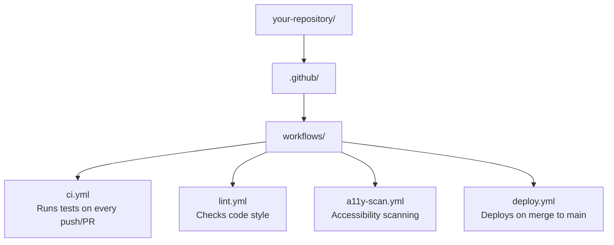

# Appendix Q: GitHub Actions and Workflows
>
> **Listen to Episode 34:** [GitHub Actions and Workflows](../PODCASTS.md) - a conversational audio overview of this chapter. Listen before reading to preview the concepts, or after to reinforce what you learned.

## Understanding Automation in Open Source Repositories

> **Why this matters for you:** Every time you open a pull request on a real open source project, automated processes will run. Understanding what they are, what they mean, and what to do when they fail is essential to being a confident contributor.


## Table of Contents

1. [What Is GitHub Actions?](#1-what-is-github-actions)
2. [Key Vocabulary](#2-key-vocabulary)
3. [Where Workflows Live in a Repository](#3-where-workflows-live-in-a-repository)
4. [The Anatomy of a Workflow File](#4-the-anatomy-of-a-workflow-file)
5. [What Triggers a Workflow](#5-what-triggers-a-workflow)
6. [Understanding Status Checks on Pull Requests](#6-understanding-status-checks-on-pull-requests)
7. [Reading the Actions Tab with a Screen Reader](#7-reading-the-actions-tab-with-a-screen-reader)
8. [Common Workflows You Will Encounter](#8-common-workflows-you-will-encounter)
9. [What To Do When a Check Fails](#9-what-to-do-when-a-check-fails)
10. [Workflow Permissions and Security](#10-workflow-permissions-and-security)
11. [Accessibility-Focused Workflows](#11-accessibility-focused-workflows)
12. [Hands-On Activity](#12-hands-on-activity)
13. [What We Are NOT Covering (And Where to Learn More)](#13-what-we-are-not-covering-and-where-to-learn-more)


## 1. What Is GitHub Actions?

**GitHub Actions** is GitHub's built-in automation system. It lets repository maintainers define automated tasks that run in response to things that happen in the repository - like someone opening a pull request, pushing a commit, or filing an issue.

Think of it as a robot assistant that every repository can optionally configure. That robot watches for specific events and then automatically runs jobs: testing code, checking spelling, scanning for accessibility issues, building documentation, deploying a website, and more.

**As a contributor, you do not need to write workflows.** But you will see their results on nearly every pull request you open, and you need to understand what those results mean.


## 2. Key Vocabulary

| Term | What It Means |
| ------  | ---------------  |
| **Workflow** | A complete automated process defined in a YAML file. A repo can have many workflows. |
| **Job** | A group of steps that run together, usually on the same machine. A workflow can have multiple jobs. |
| **Step** | A single task within a job - running a command, calling an action, etc. |
| **Action** | A reusable unit of automation. Like a plugin. Many are shared publicly on [GitHub Marketplace](https://github.com/marketplace?type=actions). |
| **Runner** | The machine (virtual server) that executes a job. GitHub provides free runners. |
| **Trigger / Event** | The thing that causes a workflow to start - a push, a PR, a schedule, etc. |
| **Status check** | The pass/fail result of a workflow shown on a pull request. |
| **Artifact** | A file produced by a workflow (a build output, a test report, etc.) that can be downloaded. |
| **Secret** | An encrypted variable stored in a repo's settings - used in workflows without exposing sensitive values. |
| **YAML** | The file format used to write workflow files. Indentation matters. |
| **`on:`** | The YAML key that defines what triggers a workflow. |
| **`runs-on:`** | The YAML key that specifies the runner OS (`ubuntu-latest`, `windows-latest`, `macos-latest`). |


## 3. Where Workflows Live in a Repository

Workflow files live in a specific, mandatory location:

Workflow files live at your-repository/.github/workflows/. Example files include: ci.yml (runs tests on every push or PR), lint.yml (checks code style), a11y-scan.yml (accessibility scanning), and deploy.yml (deploys the site when code merges to main).



The `.github/` folder is hidden by convention (starts with a dot). To find it:

- **On GitHub.com:** The file browser shows it - use `T` (go to file) or navigate the file table with `Ctrl+Alt+Arrow` keys
- **In VS Code:** It appears in the Explorer panel - enable "Show Hidden Files" if needed

> **Screen reader tip:** The `.github` folder reads as "dot github." The `workflows` folder is inside it. File names ending in `.yml` are YAML workflow files.


## 4. The Anatomy of a Workflow File

Here is a simple, real workflow file. You do not need to write this, but you should be able to read it:

```yaml
# .github/workflows/ci.yml

name: CI                          # The display name shown in the Actions tab

on:                               # What triggers this workflow
  push:
    branches: [main]              # Run when code is pushed to main
  pull_request:                   # Run when a PR is opened or updated
    branches: [main]

jobs:
  test:                           # The job name (shown in status checks)
    runs-on: ubuntu-latest        # What operating system to use
    steps:
      - name: Check out code
        uses: actions/checkout@v4 # A reusable action - downloads your repo code

      - name: Set up Node.js
        uses: actions/setup-node@v4
        with:
          node-version: '20'

      - name: Install dependencies
        run: npm install          # A shell command

      - name: Run tests
        run: npm test             # Another shell command
```

**Reading this:** The workflow named "CI" runs when code is pushed to `main` or a PR targets `main`. It creates one job called `test` that runs on Linux. That job checks out the code, installs Node.js, installs dependencies, and runs the test suite.

If `npm test` exits with an error, the job fails, and that failure shows up as a red on your pull request.


## 5. What Triggers a Workflow

The most common triggers you will encounter as a contributor:

| Trigger | What Causes It |
| ---------  | ---------------  |
| `push` | Any commit pushed to a branch |
| `pull_request` | A PR is opened, updated, synchronized, or reopened |
| `pull_request_review` | A review is submitted on a PR |
| `issue_comment` | A comment is posted on an issue or PR |
| `schedule` | A recurring timer (like a cron job) - e.g., every Monday at 9am |
| `workflow_dispatch` | A manual trigger - someone activates a button in the Actions tab |
| `release` | When a new release is published |
| `merge_group` | When a PR enters a merge queue |

**The most important one for you:** `pull_request` - this is what triggers checks on your PR.


## 6. Understanding Status Checks on Pull Requests

When you open a pull request on a repo that uses GitHub Actions, you will see a section near the bottom of the **Conversation tab** called **checks** or **status checks**.

### What the status indicators mean

| Symbol | Color | Meaning | What to do |
| --------  | -------  | ---------  | -----------  |
| Spinning circle | Yellow/Orange | Checks are running - wait | Wait for them to complete |
| Checkmark | Green | All required checks passed | Good - you may be able to merge |
| X (cross) | Red | One or more checks failed | Do not merge - read the failure |
| Slashed circle | Grey | Check was skipped | Usually fine - skipped by design |
| | Yellow | Non-blocking warning | Review but may not block merge |

### Navigating status checks with a screen reader

#### NVDA / JAWS (browse mode)

1. Open the pull request Conversation tab
2. Navigate to the section heading for "checks" using `H` or `2`
3. Each check result is announced as a link or button with its name and status
4. Press `Enter` on a failed check to expand its details

#### VoiceOver (macOS, Safari)

1. Use `VO+U` to open the Rotor
2. Select "Headings" and navigate to the checks section
3. Use `VO+Arrow` to read through check results
4. Activate a check link with `VO+Space`

### Required vs. non-required checks

- **Required checks** must pass before a PR can be merged. A maintainer configures which checks are required in Branch Protection Rules.
- **Non-required checks** are informational - a failure shown in grey/yellow usually won't block a merge.
- If you're not sure whether a check is required, look for the phrase **"Required"** next to the check name.


## 7. Reading the Actions Tab with a Screen Reader

The **Actions tab** of a repository shows the history of all workflow runs. You can use it to see what ran, what failed, and why.

### Getting to the Actions tab

1. Open the repository
2. Navigate to the "Repository navigation" landmark (`D` on NVDA/JAWS)
3. Find the "Actions" tab link and activate it (`Enter`)

### Navigating workflow runs (NVDA/JAWS browse mode)

```text
Key          Action
H            Jump between section headings
3            Jump between workflow run headings (they are h3)
Tab          Move between interactive elements (links, buttons)
Enter        Open a workflow run to see details
```

### Navigating workflow runs (VoiceOver macOS)

```text
Key                  Action
VO+U → Headings      Open rotor and navigate by heading
VO+Right/Left        Read next/previous item
VO+Space             Activate a link or button
```

### Reading a run's details

When you open a workflow run, you see:

- Job names listed on the left (or in a sidebar)
- Steps listed within each job
- Green checkmarks (passed) or red X marks (failed) next to each step

To find out **why a step failed:**

1. Navigate to the failed step
2. Activate it to expand the log output
3. The log is a large text area - switch to focus mode to read it
4. Look for lines containing `Error:`, `FAILED`, `exit code`, or `AssertionError`

> **Tip:** Log output can be very long. Use your screen reader's search (`NVDA+Ctrl+F`, `JAWS: Insert+F`, `VO+F`) to search for "error" or "failed" to jump directly to the problem.


## 8. Common Workflows You Will Encounter

As you contribute to open source repositories, you will see these types of workflows regularly:

### Continuous Integration (CI)

**What it does:** Runs the project's test suite automatically every time code changes.

**What you see:** A check called "CI", "Tests", "Build", or similar.

**If it fails:** Your code change may have broken one or more tests. Read the error message in the job log, or ask the maintainer if it is a pre-existing failure.

### Linting / Code Style

**What it does:** Checks that code follows the project's formatting and style rules - things like indentation, line length, or consistent import ordering.

**What you see:** A check called "Lint", "ESLint", "Prettier", "Flake8", or similar.

**If it fails:** Usually means a formatting rule was violated. The log will tell you exactly which file and line. Many projects include a command to auto-fix this (e.g., `npm run lint:fix`).

### Spelling / Documentation Checks

**What it does:** Checks documentation files for spelling errors, broken links, or formatting issues.

**What you see:** A check called "Spell Check", "markdownlint", "Link Check", or similar.

**If it fails:** There is a typo or formatting issue in a doc file. Very common on documentation-only contributions.

### Accessibility Scanning

**What it does:** Runs automated accessibility checks against HTML output or component libraries to catch WCAG violations.

**What you see:** A check called "a11y", "Accessibility", "axe", "pa11y", or similar.

**If it fails:** An accessibility problem was introduced. The log will describe the failing rule (e.g., "Image missing alt text", "Color contrast insufficient"). This is extremely valuable information and exactly the kind of thing this community cares about.

### Security Scanning

**What it does:** Scans for known vulnerabilities in dependencies or exposed secrets.

**What you see:** A check called "CodeQL", "Dependabot", "Snyk", or similar.

**If it fails:** A security issue was detected - inform the maintainer and do not merge.

### Deployment / Preview Builds

**What it does:** Builds and deploys a preview version of a website or app from your PR branch.

**What you see:** A bot comment on your PR with a preview URL, and a check called "Deploy", "Netlify", "Vercel", "GitHub Pages", or similar.

**What it gives you:** A live preview of what the site will look like with your changes - very useful for visual review and for accessibility testing with your screen reader on the actual rendered output.


## 9. What To Do When a Check Fails

This happens to every contributor. It is normal. Here is your step-by-step process:

### Step 1: Don't panic

A failing check is information, not a judgment. It is the system telling you something specific needs attention.

### Step 2: Navigate to the failed check

From your PR's Conversation tab:

1. Scroll down to the checks section (press `D` to reach the "Checks" region if using a screen reader)
2. Find the failing check (red X)
3. Press `Enter` on "Details" (or the check name itself) to open the workflow run

### Step 3: Find the failing step

In the workflow run:

1. Look for the step with the red X marker
2. Press `Enter` or `Space` to expand the log output

### Step 4: Read the error message

Look for:

- `Error:` - describes what went wrong
- `FAILED` or `FAIL` - test failure summary
- File name and line number - where exactly the problem is
- `exit code 1` (or non-zero) - the command failed

### Step 5: Fix the issue locally (or in the web editor)

Common fixes:

- **Test failure:** Understand what the test expects and whether your change broke something intentional
- **Lint failure:** Run the project's format/lint command, or manually fix the flagged lines
- **Spell check failure:** Fix the typo noted in the log
- **Accessibility failure:** Fix the specific a11y violation described (missing alt text, contrast issue, etc.)

### Step 6: Commit and push the fix

- The workflow will automatically re-run when you push new commits to the branch
- No need to close and re-open the PR

### Step 7: If you're stuck

It is completely acceptable to comment on your PR:

> "The CI check is failing on [step name]. I've read the error log and I'm not sure how to fix [specific issue]. Could a maintainer point me in the right direction?"

Asking for help is not weakness. It is collaboration.


## 10. Workflow Permissions and Security

### Why some workflows need your approval

If you are contributing to a repository for the first time, GitHub may hold your workflow runs for approval. You will see a message like:

> "Workflows aren't being run on this pull request. A maintainer must approve this."

This is a **security feature** - it prevents malicious code from running on the maintainer's infrastructure before they have reviewed it. Do not be alarmed. Simply add a comment like:

> "Ready for review. Could a maintainer approve the workflow runs?"

### What you should never do

- Never change workflow files to bypass checks (e.g., deleting tests to make them pass)
- Never add secrets or credentials to workflow files or code
- Never approve a workflow run on someone else's PR unless you have reviewed the code

### Dependabot

**Dependabot** is an automated bot built into GitHub that creates pull requests to update outdated or vulnerable dependencies. You will see PRs in a repository from a user called `dependabot[bot]`. These are automated, not from a person. Maintainers typically review and merge these. As a contributor, you usually don't need to interact with them, but it is good to know they exist.


## 11. Accessibility-Focused Workflows

This is relevant to our event specifically. The open source accessibility community actively uses GitHub Actions to **automatically catch accessibility regressions** - meaning, to ensure that new code does not introduce new accessibility barriers.

### GitHub's Accessibility Scanner Action

GitHub itself has open-sourced an [AI-powered Accessibility Scanner](https://github.com/marketplace/actions/accessibility-scanner) that can be added to a repository. It uses AI to find, file, and help fix accessibility bugs using GitHub Copilot.

A basic workflow using it looks like this:

```yaml
name: Accessibility Scan

on:
  pull_request:
    branches: [main]

jobs:
  a11y:
    runs-on: ubuntu-latest
    steps:
      - uses: actions/checkout@v4
      - name: Run Accessibility Scanner
        uses: github/accessibility-scanner@v1
        with:
          github-token: ${{ secrets.GITHUB_TOKEN }}
```

### Common tools used in a11y workflows

| Tool | What It Checks |
| ------  | ----------------  |
| [axe-core](https://github.com/dequelabs/axe-core) | WCAG violations in HTML/rendered pages |
| [pa11y](https://pa11y.org/) | Automated accessibility testing against URLs |
| [jest-axe](https://github.com/nickcolley/jest-axe) | axe checks inside unit tests |
| [Lighthouse CI](https://github.com/GoogleChrome/lighthouse-ci) | Accessibility + performance scoring |
| [IBM Equal Access Checker](https://github.com/IBMa/equal-access) | WCAG 2.1 / 2.2 compliance checking |

#### What these tools catch (and what they do not)

Automated tools catch approximately **30-40% of accessibility issues** - things like missing alt attributes, insufficient color contrast ratios, or unlabeled form fields. The remaining issues require human testing, especially with actual assistive technology like your screen reader.

This is precisely why **manual testing by people who use screen readers is so valuable and irreplaceable.**

### Preparing the Environment for GitHub-Hosted Agents

When custom agents run on GitHub.com - triggered by an issue assignment or a Copilot Chat task - they need any external tools pre-installed before they start working. GitHub recognizes a special setup workflow for this: a workflow file with a single job named `copilot-setup-steps`.

**Location:** `.github/workflows/copilot-setup-steps.yml`

```yaml
name: Copilot Setup Steps

on: workflow_dispatch

jobs:
  copilot-setup-steps:
    runs-on: ubuntu-latest
    steps:
      - name: Setup Node.js
        uses: actions/setup-node@v4
        with:
          node-version: '20'

      - name: Install accessibility testing tools
        run: npm install -g @axe-core/cli markdownlint-cli2
```

**What this does:** Before a Copilot coding agent begins working, GitHub runs this job to prepare the environment. Without it, an agent that needs `markdownlint-cli2` (for the Markdown Accessibility Assistant) or `@axe-core/cli` (for WCAG scanning) will fail because those tools are not present.

**The job name `copilot-setup-steps` is required** - GitHub won't recognize any other name for agent environment preparation.

**Connection to Section 13 of the VS Code guide:** This is the infrastructure that enables Scope 3 (cloud execution) of the three-layer Accessibility Agents model. The same agent you run in VS Code with `@markdown-accessibility-assistant` can run on GitHub.com automatically - but only if the environment is prepared with this workflow.


## 12. Hands-On Activity

### Activity: Explore a Workflow in This Repository

> **Goal:** Practice navigating the Actions tab and reading a workflow file using your screen reader.

#### Steps

1. Navigate to the `learning-room` repository on GitHub
2. Go to the **Actions tab** (in the Repository navigation landmark)
3. Use `3` (NVDA/JAWS) or the Headings rotor (VoiceOver) to navigate the list of workflow runs
4. Open the most recent run
5. Find any failed step and expand its log
6. Navigate to the `.github/workflows/` folder via the Code tab
7. Open a workflow `.yml` file
8. Read through the file and identify:
   - What event triggers it
   - What OS it runs on
   - How many steps it has
   - What the last step does

#### Discussion questions

- What would happen if you opened a PR and the "Accessibility Scan" check failed?
- Where would you look to find out what accessibility violation was detected?
- If you disagreed with a failing lint check, what would be the appropriate way to raise that with a maintainer?


## 13. What We Are NOT Covering (And Where to Learn More)

GitHub Actions is a deep topic. This workshop covers what you need as a **contributor**. We are intentionally not diving into:

- Writing workflow files from scratch
- Setting up self-hosted runners
- Creating custom Actions
- Advanced workflow patterns (matrix builds, reusable workflows, environments)
- Secrets management and OIDC authentication

When you are ready to go deeper, these are the best places to start:

| Resource | Link |
| ----------  | ------  |
| GitHub Actions Documentation | [GitHub Actions docs](https://docs.github.com/en/actions) |
| GitHub Skills: Hello GitHub Actions | [Hello GitHub Actions course](https://github.com/skills/hello-github-actions) |
| GitHub Skills: Continuous Integration | [Continuous Integration course](https://github.com/skills/continuous-integration) |
| GitHub Marketplace (Actions) | [GitHub Marketplace for Actions](https://github.com/marketplace?type=actions) |
| GitHub Accessibility Scanner | [Accessibility Scanner action](https://github.com/marketplace/actions/accessibility-scanner) |
| GitHub Actions Accessibility Conformance Report | [Accessibility conformance report](https://accessibility.github.com/conformance) |


## Summary

| Concept | Key Takeaway |
| ---------  | -------------  |
| Workflows live in `.github/workflows/` | YAML files that define automation |
| Triggers fire workflows | `push`, `pull_request`, `schedule` are the most common |
| Status checks appear on your PR | Green checkmark, Red X, Yellow circle = pass, fail, running |
| Required checks must pass | Configured by maintainers - blocks merging if failing |
| Failing checks are normal | Read the log, fix the issue, push again |
| a11y workflows catch ~30-40% of issues | Human screen reader testing catches the rest |
| First-time contributors may need approval | A security feature - ask a maintainer politely |


> ### Day 2 Bridge - From Actions to Agentic Workflows
>
> **Understand standard YAML workflow files before engaging with agentic workflows.** GitHub Agentic Workflows are not a separate technology - they are the next layer on top of what you learned here. They share the same trigger model, the same permissions system, and the same `.github/workflows/` directory. You cannot evaluate whether an agentic workflow is safe or correct unless you can already read a standard one.
>
> The three layers, in sequence - each builds on the one before it:
>
> 1. **Standard GitHub Actions** - YAML files in `.github/workflows/`; define triggers and structured shell steps; what you mastered in this guide
> 2. **Accessibility Agents in VS Code** - `.agent.md` files in `.github/agents/`; define behavior in plain English; GitHub Copilot Chat executes them on demand in your editor - same `.github/` folder, plain text, no YAML required
> 3. **GitHub Agentic Workflows in the cloud** - `.md` files in `.github/workflows/`; define intent in plain Markdown frontmatter; a coding agent (Copilot CLI, Claude Code, OpenAI Codex) executes them inside GitHub Actions on any trigger - no VS Code, no local setup required
>
> All three live in `.github/`. All three are plain text. All three run on your behalf. The only difference is where they run and how sophisticated their executor is.
>
> *You cannot skip a layer. Each one only makes sense because you understand the one before it.*


*Back: [GitHub Concepts and Glossary](appendix-a-glossary.md)*
*Related: [Day 1 Agenda](../DAY1_AGENDA.md) | [Day 2 Agenda](../DAY2_AGENDA.md)*
